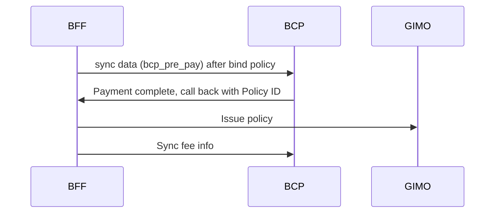
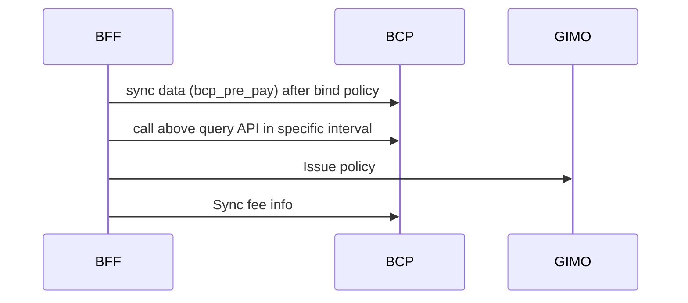

# NIC_BCP_integration

## Overview

### Project Background

The project is to integrate NIC easyPA and BCP system to support the business scenario of issuing policy after payment.

### Objectives

- To integrate NIC easyPA and BCP system to support the business scenario of issuing policy after payment.

- track integration process and ensure the integration is successful.

### Scope

Systems involved: BFF , GIMO , BCP

| System | Description                              |
|--------|------------------------------------------|
| BFF    | easyPA                                   |
| GIMO   | GI middle service                        |
| BCP    | BCP module in v3 core transaction system |

## Architecture

### Technology Stack

API Technologies: REST API, SOAP.

## Data Flow & Business Logic

### Solution A : Call back from BCP after payment complete



#### Business Logic Description

- BFF bound policy and sync data t pa bcp_pre_pay to BCP for first payment data

- BCP finish payment for per pay ,call back BFF with policy id or NO

- BFF call GIMO for issue policy and sync fee info to BCP

- track integration process and ensure the integration is successful.

### Solution B : BCP provide status API for Query



#### Business Logic Description for B

- BFF bound policy and sync data t pa bcp_pre_pay to BCP for first payment data

- BCP finish payment for pre-pay.

- BCP provide a query API to check pre-pay is paid or not.

- BFF call above query API in specific interval to check the pre-pay paid status. If paid, call GIMO for issue policy
  and sync fee info to BCP.

- track integration process and ensure the integration is successful.

## Interface Design

### BCP provide APIs:

- API One: to receive pre-pay data from pa and save into BCP. The payload mainly include:  fee type, fee amount, related
  business transaction info(policy info, agent info, policyholder/insured info, product info, payer info...)  .

- API Two: to receive the total fee info from pa and save into BCP. The payload is similar to API One.

- API Three:  to check paid status for pre-pay fee. The payload is trans type(NB, ENDO, Renew) and trans id(policy id,
  endo id, renew id). The response is paid status as Boolean value true or false.

### API Specifications

> The JSON format below is used to illustrate the payload structure, while the project implementation requires SOAP to
> adopt XML/WSDL representation.

#### API : receive pre pay data from pa

- Description: This API to receive pre-pay data from pa and save into BCP. The payload mainly include:  fee type, fee
  amount, related business transaction info(policy info, agent info, policyholder/insured info, product info, payer
  info...)  .

- Method: SOAP

- System : BCP

- URL: /bcp/prepay

- Request Payload:

```json
{
	"bizModule": "10",
	"bizSource": "1",
	"bizTransType": "NEWBIZ",
	"bizUniqueId": "10480820003,F1667CDCE5A70F96A903AB469718D075",
	"bookingCurrencyCode": "CNY",
	"branchCode": "10006",
	"channelCode": "PTY10000047304001",
	"claimNo": null,
	"currencyCode": "CNY",
	"directBookingEr": 1,
    "isPrepay": "N",
	"paymentMethod": "100",
	"paymentType": "1",
	"policyHolderName": "PolicyCollection",
	"policyHolderTypeCode": "",
	"policyHolderTypeName": "IndiCustomer",
	"policyNo": "POTBTI01238631",
	"productCode": "TBTI",
	"productLineCode": "Travel",
	"productName": "API TEST",
	"quotationNo": "",
	"refTransId": "10480820003,F1667CDCE5A70F96A903AB469718D075",
	"refTransNo": "POTBTI01238631",
	"totalPeriods": 1,
	"dynamicProperties": {},
	"feeList": [
		{
			"bcpFeeType": "100101",
			"amountSign": "+",
			"arapCate": "1",
			"arapStatus": "1",
			"bankName": null,
			"commissionStatus": "1",
			"creditCardHolderName": null,
			"creditCardNo": null,
			"orderStatus": "",
			"payerPayeeType": "IndiCustomer",
			"branchCode": "10006",
			"currencyCode": "CNY",
			"payerPayeeName": "PolicyCollection",
			"paymentMethod": "100",
			"totalPeriods": 1,
			"directEr": 1,
			"directBookingEr": 1,
			"amount": 1004.4,
			"balance": 1004.4,
			"feeId": 10480820015,
			"currentPeriod": 1,
			"dueDate": "2024-05-18",
			"glPostDueDate": "2024-05-18",
			"periodStartDate": "2024-05-18",
			"periodEndDate": "2024-05-18",
			"commission": 93,
			"tax": 74.4
		},
		{
			"bcpFeeType": "100400",
			"amount": 74.4,
			"amountSign": "+",
			"arapCate": "1",
			"arapStatus": "1",
			"commissionStatus": "1",
			"feeId": 10480820015,
			"branchCode": "10006",
			"dueDate": "2024-05-18",
			"glPostDueDate": "2024-05-18",
			"currencyCode": "CNY",
			"directEr": 1,
			"directBookingEr": 1,
			"currentPeriod": 1,
			"totalPeriods": 1,
			"periodStartDate": "2024-05-18",
			"periodEndDate": "2024-05-18",
			"payerPayeeName": "PolicyCollection",
			"payerPayeeType": "IndiCustomer",
			"paymentMethod": "100"
		},
		{
			"bcpFeeType": "100501",
			"amount": 930,
			"amountSign": "+",
			"arapCate": "1",
			"arapStatus": "1",
			"commissionStatus": "1",
			"feeId": 10480820015,
			"branchCode": "10006",
			"dueDate": "2024-05-18",
			"glPostDueDate": "2024-05-18",
			"currencyCode": "CNY",
			"directEr": 1,
			"directBookingEr": 1,
			"currentPeriod": 1,
			"totalPeriods": 1,
			"periodStartDate": "2024-05-18",
			"periodEndDate": "2024-05-18",
			"payerPayeeName": "PolicyCollection",
			"payerPayeeType": "IndiCustomer",
			"paymentMethod": "100"
		}
	]
}
```

- Response Payload:

```json
[
    {
        "@pk": 10473721498,
        "@type": "BcpArap-Arap",
        "Amount": 1004.4,
        "ArapCate": "1",
        "ArapId": "10473721498,F28FD2BF01580A36D0A2BF0349515204",
        "ArapNo": "DR20240500003747",
        "ArapStatus": "1",
        "ArapType": "-1001",
        "Balance": 1004.4,
        "BizTransId": "10473721494,21F48E90D78E99D2B12936D3317301E8",
        "BookingCurrencyCode": "CNY",
        "BusinessObjectId": 1100002651088,
        "Commission": 93,
        "CurrencyCode": "CNY",
        "CurrentPeriod": 1,
        "DirectBookingEr": 1,
        "DirectEr": 1,
        "DueDate": "2024-05-18",
        "GenerateDate": "2024-05-17T14:47:09.554",
        "HasMandate": "N",
        "HasNote": "N",
        "IsApproved": "N",
        "IsOffsetByCommission": "N",
        "LocalCurrencyCode": "INR",
        "NeedStatement": "N",
        "OffsetAmount": 0,
        "OffsetByCommissionAmount": 0,
        "OperateTime": "2024-05-17T14:47:09.554",
        "PayerPayeeName": "PolicyCollection",
        "PayerPayeeType": "IndiCustomer",
        "PaymentMethod": "100",
        "PeriodEndDate": "2024-05-18",
        "PeriodStartDate": "2024-05-18",
        "RefFeeId": 10473721495,
        "Tax": 74.4,
        "TotalPeriods": 1,
        "Transaction": {
            "@pk": 10473721494,
            "@type": "BcpBizTransaction-BizTransaction",
            "BizModule": "10",
            "BizSource": "1",
            "BizTransId": "10473721494,21F48E90D78E99D2B12936D3317301E8",
            "BizTransTime": "2024-05-17T14:47:06",
            "BizTransType": "NEWBIZ",
            "BizUniqueId": "10480820003,F1667CDCE5A70F96A903AB469718D075",
            "BookingCurrencyCode": "CNY",
            "BranchCode": "10006",
            "BranchName": "India Branch",
            "BusinessObjectId": 1100002651370,
            "ChannelCode": "PTY10000047304001",
            "ChannelName": "MANDYTEST0418 WU",
            "ChannelType": "13",
            "ChannelTypeName": "Individual Agent",
            "CurrencyCode": "CNY",
            "DirectBookingEr": 1,
            "DirectEr": 1,
            "HasMandate": "N",
            "LocalCurrencyCode": "INR",
            "PaymentMethod": "100",
            "PaymentType": "1",
            "PolicyHolderName": "PolicyCollection",
            "PolicyNo": "POTBTI01238631",
            "ProductCode": "TBTI",
            "ProductLineCode": "Travel",
            "ProductName": "API TEST",
            "RefTransId": "10480820003,F1667CDCE5A70F96A903AB469718D075",
            "RefTransNo": "POTBTI01238631",
            "TotalPeriods": 1
        },
        "VersionSeq": 1
    }
]
```

#### API : receive total fee data from pa

- Description: This API to receive the total fee info from pa and save into BCP. The payload is similar to API One.

- Method: SOAP

- System : BCP
- URL: /bcp/total/fee

- Request Payload:

```json

{
	"bizModule": "10",
	"bizSource": "1",
	"bizTransType": "NEWBIZ",
	"bizUniqueId": "10480820003,F1667CDCE5A70F96A903AB469718D075",
	"bookingCurrencyCode": "CNY",
	"branchCode": "10006",
	"channelCode": "PTY10000047304001",
	"claimNo": null,
	"currencyCode": "CNY",
	"directBookingEr": 1,
    "isPrepay": "N",
	"paymentMethod": "100",
	"paymentType": "1",
	"policyHolderName": "PolicyCollection",
	"policyHolderTypeCode": "",
	"policyHolderTypeName": "IndiCustomer",
	"policyNo": "POTBTI01238631",
	"productCode": "TBTI",
	"productLineCode": "Travel",
	"productName": "API TEST",
	"quotationNo": "",
	"refTransId": "10480820003,F1667CDCE5A70F96A903AB469718D075",
	"refTransNo": "POTBTI01238631",
	"totalPeriods": 1,
	"dynamicProperties": {},
	"feeList": [
		{
			"bcpFeeType": "100101",
			"amountSign": "+",
			"arapCate": "1",
			"arapStatus": "1",
			"bankName": null,
			"commissionStatus": "1",
			"creditCardHolderName": null,
			"creditCardNo": null,
			"orderStatus": "",
			"payerPayeeType": "IndiCustomer",
			"branchCode": "10006",
			"currencyCode": "CNY",
			"payerPayeeName": "PolicyCollection",
			"paymentMethod": "100",
			"totalPeriods": 1,
			"directEr": 1,
			"directBookingEr": 1,
			"amount": 1004.4,
			"balance": 1004.4,
			"feeId": 10480820015,
			"currentPeriod": 1,
			"dueDate": "2024-05-18",
			"glPostDueDate": "2024-05-18",
			"periodStartDate": "2024-05-18",
			"periodEndDate": "2024-05-18",
			"commission": 93,
			"tax": 74.4
		},
		{
			"bcpFeeType": "100400",
			"amount": 74.4,
			"amountSign": "+",
			"arapCate": "1",
			"arapStatus": "1",
			"commissionStatus": "1",
			"feeId": 10480820015,
			"branchCode": "10006",
			"dueDate": "2024-05-18",
			"glPostDueDate": "2024-05-18",
			"currencyCode": "CNY",
			"directEr": 1,
			"directBookingEr": 1,
			"currentPeriod": 1,
			"totalPeriods": 1,
			"periodStartDate": "2024-05-18",
			"periodEndDate": "2024-05-18",
			"payerPayeeName": "PolicyCollection",
			"payerPayeeType": "IndiCustomer",
			"paymentMethod": "100"
		},
		{
			"bcpFeeType": "100501",
			"amount": 930,
			"amountSign": "+",
			"arapCate": "1",
			"arapStatus": "1",
			"commissionStatus": "1",
			"feeId": 10480820015,
			"branchCode": "10006",
			"dueDate": "2024-05-18",
			"glPostDueDate": "2024-05-18",
			"currencyCode": "CNY",
			"directEr": 1,
			"directBookingEr": 1,
			"currentPeriod": 1,
			"totalPeriods": 1,
			"periodStartDate": "2024-05-18",
			"periodEndDate": "2024-05-18",
			"payerPayeeName": "PolicyCollection",
			"payerPayeeType": "IndiCustomer",
			"paymentMethod": "100"
		}
	]
}
```

- Response Payload:

```json

[
    {
        "@pk": 10473721498,
        "@type": "BcpArap-Arap",
        "Amount": 1004.4,
        "ArapCate": "1",
        "ArapId": "10473721498,F28FD2BF01580A36D0A2BF0349515204",
        "ArapNo": "DR20240500003747",
        "ArapStatus": "1",
        "ArapType": "-1001",
        "Balance": 1004.4,
        "BizTransId": "10473721494,21F48E90D78E99D2B12936D3317301E8",
        "BookingCurrencyCode": "CNY",
        "BusinessObjectId": 1100002651088,
        "Commission": 93,
        "CurrencyCode": "CNY",
        "CurrentPeriod": 1,
        "DirectBookingEr": 1,
        "DirectEr": 1,
        "DueDate": "2024-05-18",
        "GenerateDate": "2024-05-17T14:47:09.554",
        "HasMandate": "N",
        "HasNote": "N",
        "IsApproved": "N",
        "IsOffsetByCommission": "N",
        "LocalCurrencyCode": "INR",
        "NeedStatement": "N",
        "OffsetAmount": 0,
        "OffsetByCommissionAmount": 0,
        "OperateTime": "2024-05-17T14:47:09.554",
        "PayerPayeeName": "PolicyCollection",
        "PayerPayeeType": "IndiCustomer",
        "PaymentMethod": "100",
        "PeriodEndDate": "2024-05-18",
        "PeriodStartDate": "2024-05-18",
        "RefFeeId": 10473721495,
        "Tax": 74.4,
        "TotalPeriods": 1,
        "Transaction": {
            "@pk": 10473721494,
            "@type": "BcpBizTransaction-BizTransaction",
            "BizModule": "10",
            "BizSource": "1",
            "BizTransId": "10473721494,21F48E90D78E99D2B12936D3317301E8",
            "BizTransTime": "2024-05-17T14:47:06",
            "BizTransType": "NEWBIZ",
            "BizUniqueId": "10480820003,F1667CDCE5A70F96A903AB469718D075",
            "BookingCurrencyCode": "CNY",
            "BranchCode": "10006",
            "BranchName": "India Branch",
            "BusinessObjectId": 1100002651370,
            "ChannelCode": "PTY10000047304001",
            "ChannelName": "MANDYTEST0418 WU",
            "ChannelType": "13",
            "ChannelTypeName": "Individual Agent",
            "CurrencyCode": "CNY",
            "DirectBookingEr": 1,
            "DirectEr": 1,
            "HasMandate": "N",
            "LocalCurrencyCode": "INR",
            "PaymentMethod": "100",
            "PaymentType": "1",
            "PolicyHolderName": "PolicyCollection",
            "PolicyNo": "POTBTI01238631",
            "ProductCode": "TBTI",
            "ProductLineCode": "Travel",
            "ProductName": "API TEST",
            "RefTransId": "10480820003,F1667CDCE5A70F96A903AB469718D075",
            "RefTransNo": "POTBTI01238631",
            "TotalPeriods": 1
        },
        "VersionSeq": 1
    }
]

```

#### API : check paid status for pre-pay fee [use solution B]

- Description: to check paid status for pre-pay fee. The payload is biz trans type(NB, ENDO, Renew) and biz trans unique
  id . The response is paid status.

- Method: SOAP

- System : BCP

- URL: /bcp/prepay/status

- Request Payload :

```json
{
	"bizTransType": "NEWBIZ",
	"bizUniqueId": "10480820003,F1667CDCE5A70F96A903AB469718D075",
}

```

- Response Payload:

```json

{
    "paidStatus": "1",
    "paidMessage": "pre pay is paid"
}

```

### API : call back API after payment complete [use solution A]

- Description: call back API after payment complete. The payload is biz trans type(NB, ENDO, Renew) and biz trans unique
  id . The response is status

- Method: REST

- System : BFF

- URL: /bcp/callback

- Request Payload : TODO

```json
{
	"bizTransType": "NEWBIZ",
	"bizUniqueId": "10480820003,F1667CDCE5A70F96A903AB469718D075",
}
```

- Response Payload:

```json
{
   "status": "1",
   "message": "Success"
}

```

## Data Synchronization & Scheduling

### Scheduled Tasks

if solution B, BFF need to call BCP query API in specific interval to check the pre-pay paid status.

### Exception Handling

TODO How to handle exception in the integration process.

## Security & Access Control

TODO security and access control approach in network and API level.

### Data Encryption

### Audit Logs

## Appendix

### EasyPA Related Tables

| Table Name                 | Description                |
|----------------------------|----------------------------|
| t_pa_bcp_policy_fee        | Policy fee                 |
| t_pa_bcp_policy_fee_info   | Policy fee info            |
| t_pa bcp_policy_fee instal | Policy fee instalment info |
| t_pa_bcp_pre_pay           | Pre-pay info               |

🤖 AI-Powered Insights:

- Product A shows strong growth, contributing 43% of total sales.
- Bank channels outperform agent channels for Product B.
- Target marketing efforts for Product C in underperforming regions.

![test](data:image/png;base64,iVBORw0KGgoAAAANSUhEUgAAArwAAAH0CAYAAADfWf7fAAAgAElEQVR4Xu2dC7zVU/r/nzpddFMuRe40ZHIbBuM2I8yIcWncB+MucisSUdKFkG6UEikpl1SIiBolwrj7GZcxLuMeSpSMojrn93q++Z4553TO2XufZ53d2mu99+v1f/1/o+9a51nvz9Pqfb577e+uU1JSUiK8IAABCEAAAhCAAAQgECiBOghvoMmyLAhAAAIQgAAEIACBhADCSyNAAAIQgAAEIAABCARNAOENOl4WBwEIQAACEIAABCCA8NIDEIAABCAAAQhAAAJBE0B4g46XxUEAAhCAAAQgAAEIILz0AAQgAAEIQAACEIBA0AQQ3qDjZXEQgAAEIAABCEAAAggvPQABCEAAAhCAAAQgEDQBhDfoeFkcBCAAAQhAAAIQgADCSw9AAAIQgAAEIAABCARNAOENOl4WBwEIQAACEIAABCCA8NIDEIAABCAAAQhAAAJBE0B4g46XxUEAAhCAAAQgAAEIILz0AAQgAAEIQAACEIBA0AQQ3qDjZXEQgAAEIAABCEAAAggvPQABCEAAAhCAAAQgEDQBhDfoeFkcBCAAAQhAAAIQgADCSw9AAAIQgAAEIAABCARNAOENOl4WBwEIQAACEIAABCCA8NIDEIAABCAAAQhAAAJBE0B4g46XxUEAAhCAAAQgAAEIILz0AAQgAAEIQAACEIBA0AQQ3qDjZXEQgAAEIAABCEAAAggvPQABCEAAAhCAAAQgEDQBhDfoeFkcBCAAAQhAAAIQgADCSw9AAAIQgAAEIAABCARNAOENOl4WBwEIQAACEIAABCCA8NIDEIAABCAAAQhAAAJBE0B4g46XxUEAAhCAAAQgAAEIILz0AAQgAAEIQAACEIBA0AQQ3qDjZXEQgAAEIAABCEAAAggvPQABCEAAAhCAAAQgEDQBhDfoeFkcBCAAAQhAAAIQgADCSw9AAAIQgAAEIAABCARNAOENOl4WBwEIQAACEIAABCAQtfCuXLVKli//WRrUrycNGtSPqht+XLZciotLpGmTRrWy7lf/+Z688c4H0rHDfrLBeuvWys+wTvqPV96Wf33wiRx7eHtZt2lj63RrjC8pKZH//rhcioqKpNE6DTLOP33W8/L9Dz/KyUf/MeO11V3w0adfyvOvvC0LFy1O8j3xLweJ1pJtHaYfXmGwqzW5rEnnuv/hOfLfZculQ/s9ZdONN5RPv1ggT857RdZt2kSOPXx/1z+O+SAAAQhAYC0T8Fp4h499QG6bOD1BNH3C9bLNFq2zxrXHoZ1Fpa6q18z7Bsnrb74vV1x3u3Q6+XC5uNOxWc/t24WXXzNaHpv9QmlZjRutI82aNpKdf91G/nLIfrLf73aSekVF5co+8LhL5OuF38lLM0ZLk8brOF/SLeMeklsnPCxTx/STX2+7pfP5XUx43fB75J4H/y6P33OjbLFpKxdTlpvj8y8XSocTL5Md224t99/WJ/mzT7/4WqZMf1r233sX2X2XtuWuP+HcfvKfT7+Ulx8fXeNaXnjtHTmr243lxt9zy1Vy8oXXlqujxj8gx4Eu1pTjj8x4+ZPzXpWuvUfI0X/+g/TrfobUrVtHVq0qll4D7xAV9NEDu8nvf7dzxnm4AAIQgAAECoeAt8Krdx/3P7qLfLt4aULzgjOOkvNP65g12VR4Vfgqe13a+QR57z+fyV2TZ8rB++8uRx36+6zn9u3Cbn1Hycy5L8nhf9pbmjZuJN8t+UE++nS+vPefz5NSD/r9bjKs74VSVFS3tPReN9yRsB3W7wJZp2Hmu4+5rhnhFfnm2yXS+8ZxstXmG0uPC05MEL70+rtyxiU3yOUXnCinHdfBufCefvEN8vL/vSt3DL5M9th1++QOs76L0XfI+HJ15JpnTa/3TXh/XPaTHH7qFdK8WROZMqZfuV8EV6xYKR3P6JXI78PjB9TK34uacmQcBCAAAQjYCHgrvK+9+b6cctEAOe7w9jLl0bmyWeuW8sS9N0qdOnWyWrEK7zoN68u8aSOyur6QL0qFt+Kdyn+9/4n0uPY2+fCT+XLqcR1KpSsfa10bwqtv22fbH8qgtu/wVsa5toVX+75tm83l7lt65RRzruyyndw34U3fNRo75HLZ67ft1ljG0/94Q86/cphcdObR0vnUI7NdJtdBAAIQgIDnBLwV3gE3T5R7H5otk0b3kTsnzZCZc19O/u+dtt86K6TZCK8K4fCxD8rxR7aXA/bZtXRePfs47PYpMu/FfyZ3QXfdcVvZdpvN5KsF38o1l58pG67fXL5bslR6Xn9H8tbnSUcdVK6m7v1vTa654sKTkv++/Kef5ZI+I2W3nbaV4488QB587Bl5893/SLOmjZO3VPWlUnrzHVOTYxbpzzzvtI6y7x47ZlxvVcKrA79a+K0c16lPMuedw66QPXfdPplv0KhJ8sVX38hN/S8snf/dDz6V2+9+VP7v7fdl6Q/LZMvNNpJ9dt9BTjr6j7Jxy/Xl7X9/LLfc+VByTOLjz76SJ556MbmLrHwu7Xx88v+nr8qEV3/mK2/8W+Z//U1Sj/4S86f9d5czTji09JyvCsm/3v9UenX9W/LnZV9TH31aZj/7mlxwxl+St+f1tWTpf+WWcQ/Kcy+/JZ98/rVst81myd36k4/+U7k72ou++16G3jZZnnnhjeRn77bTdrJs+U+iPZDpSMN1w+/+hdVFUr/e6qMhr735noy55zE5+6TD5Lc7b1cu5x3bbpW8I6F3DLv0HiG7tGuTyNM/3/lQBtx8t7z174+StW2z5SbJOO0LPVaTyuGk0VfLyDunJf2nr0MO2FMuP/+vSb9U9dLz6Bf1Gp6sT4+0pMcl/nzg75LxZetI5/j55xVJ3jPmvJCw07z323Mn+Wz+Qjn12INl7913qLb3dPx9D8+RGU++kBzF0GM0enzlyIP3Sc7G6ivXNSnXUXc9LG+8/WHyC+tvd24r3c49TrbYdKNkvjf/9Z/kz/XdjMMO2qu0vn5D75KS4hLp2/300v/28Mzn5ImnXkrYbb1F6+Tv7H4dL8p4tOOoM69K+vofj46qlbPdGf9CcwEEIAABCDgn4KXwqijsc+SFyT+gsycPlb8/86pc0ucWOf34Q+Sy8/+aFYRshFc/tHR290HSs8vfSj8otOCbxXLYKVck539VnrbcbONEivQ8pr5SOfpywbfyx+O7JQLbp9tp5WrSn63yoOdX9fXDf5fJ7w47TzZquV4iQekxjfVbNEvuQKsEntb1+l/kZztp0rihzHvxzeR/j7zuYmm/z2+qXXN1wqsDH5n1nFx53RjpctYxcu4pRyRz/e3CAfL6W+/L23PHJ/9bP+h0+KlXJv+3io5+iOv/3v4gOed7Q89z5IiD90kErHOPoaW1qLTpMQmVJX09fOcA+dXWmyb/d2XC+/u/XCTLf1ohu+zQJvlw0Nv//ijhqvJ6z6irkreXH3jsGbl60Dg579SOcuGZR5X+LBW6A465OBn/7MMjpGGD+qISe9w5fZIatRYVy/Qs85l//XMi4fpS3h1P75n8/5qLys8HH32xRqZVQb5m2ASZ9PAcmXxbX9mh7VbJZSpYkx95KvmAU/pLiwrtiedfU3r8Ztnyn2X3Q85JjpQMv6ZLkrMeJdE1a/YbtVw/mUt/qeh27vGJHKoMpy/loiKpvajnTfWXrapeK1aukhPP65/0qr7Sc9PHH9Fejjh433J16J/r2/Z6/EEFU/tyx+23lq8XfFf686+7spN07LBvtX3XZ/Cdor+E6Pjdd24r879elPSU/u85U4YlY3NZU3q2Vsd1aL+HKD8VeH09NO7a5O+j/v084NjVfyf074a+9Je6g47rlvzff580WDbZeMPk/+7cY0jy9+jlx2+Txo0aJsd+9O9Kr66nrPFLatmFjr//CRl06yQZMaCrHLjv/34RrhYGfwgBCEAAAl4T8FJ4U7FSOVNJ03N3exx6biIJTz1w0xofwKqMcHqGN70TWPYavQukQlCZ8Pa8fozonSEVaxXs9HXVwLHy0OPzTMKrc6n8nHpsh+Tu3tIffpRNW28oR5/ZO7nD+8j4AdJmq9XCmAqo/iOv/9hX98okvO9/9Ln85Yyr5A977SK33nBJMlVF4R0x7kEZPeER6X/ZmXLMYX9IrtFz1Coherda70KmuSjT/pefmbx1rq877n0suSNeVsoqE16VMb1Tnn6ATufv2nu4zHnu9VJZ1jOne/65c5L1nKk3ld5Rfer51+XCnjcnwq49oa9URFXO9K6iHmdQOTy2U59Ewp9+8Oak9vTdAr3LeuEZR5Uee9DztQ/OeCbjHd5UlK66+JTkiQcqi3sdfn7ys/Ru6j8eHZmsSd+R0J+V3kmvKLxac6YjDSq8WufZJx2ePNlBpf6Qky5PftY/Z48rd9e6sp7Yof3pyd3riSN6lv5xZXVoL2tPq1he3/Oc5BcIfWnv69+BTMKr9ejfMZXbJ+65sfQpJyqk+guW3vnWVyq8mdb0088r5NCTL09+eXl0wvXJLyX6So8Y/P53O8nogZcm/+3Pf+shCxctkRcfuzX5wJn+4qG/gOgrlVntLf0lc/tfbVHKov+wCcnTGfQDqxXfPSjLMv27l+9jQF7/S0FxEIAABAqcgJfCq09O0E9Ll/2Ef/okgrFDL5e9dlvz7F3FHFLhVXGq+NI7Qzu3a7OG8Oo/kjsdeEbyj+GMuweWk4uK5z1rcoe37D/aaU1vvvuR/LVzv+RO8VVdTylXqt711Ttmr88aU+1j0zIJr771vOvBnRKJTM80VxRefZt45J0PJUJ53ml/KRXNsgWlwnv1JafKCR0PLP0jlZXdDu6UcFOZ0FdVZ3iVsX6g7vMv9VjD96IiO3vea+XuZOsRgnsefDK5K6q/IOgrvVs3a9Lg5DFSZbN67O4bpI7872z3qLumJfKeimfaC888NLzcI9KyPcOrR1zaH3Nx8hb6jb07J5koPz3aMe2JZ0t/To8Bt8mjf/+HvPLE7Yms1kR4K3tKQ7e+I5MjPXMfuElabtCi2i0nW+G9qNfNyS8aT94/RFpvtEHpnH9/5hW5+OpbshZe7al7Rvau8ikXVZ3hrbimlKkeRenZ5eRya0x7NT1ikPbHI3ddJ2223ETOuWxw8kux5tRqw/USwU2lteyHXS/oeZPMff7/5I3ZY6v9pTn9+6K/DAzte0GBb/GUDwEIQAACSsA74U3v5uqds8m/PMpJC9V/nPUMZtm3kKuLsCZHGlKJPfTA38ngq88rN70L4dVzjUP7nl9u3hmzX5TLrrm12m4s+zZtZRdmEl59FNahJ/dIjirop/f1VVF49cyinl3Ul7LXs8l77fbr5O3w9BmyVQmvjknPPb45587krltlwqt3i/sNGV96pKPsWsq+ffzvDz+To8/qnZxfvn1Q9+QIgD7eS99e1uv0lWZVHbiBvc5NPpi0/9Fdkzv66RGTdEy2wqvX611FvSOvvzDo3Wy9mztr0qDkTOgpxx6cnNfWR73pWdPxN12R/AhXwpsen8jUB/ozsxVe5alHPCo+Ai1b4dWflQq+/t/6C+SuO/wqOfpS9jF0VQlvxTXpL7j6i64e29B3Csq+0pweuKN/csc2rfHaHmfJgfvtJvsccUFyLOm7xUuTR+Hpnf0XXn0nqU+z2OM3q8+tay0Lv11cetyiut7R4zdbbd663J1y/smAAAQgAIHCJeCd8KZvH1eFVGVs3rThGR8ZVBPhTcWw7Fv/VclRTe7wVia8+gSKvoPHJ6Kg5yAre/35oN8lElrVK5Pw6h3ULr2HJ2di9WysvioKr/63+V99IyPHT5NZT79S+gxjvYM3YXjP5C3mbIT3rafuTI4MVBTe9PiIrkPr2PnX28imG7eU2c++KtfeNHGN85JpffpkjoefeC4RGZX19INUegTkyNN6Jud/jzuifaVo9AN6evxAzybr3dgBV5xdqUhl+tCaDho48j6ZMGWm6B3mMy8ZmIi0nt3VO6V61vmBO65JzpaW/XS/K+FNj264FF4VOhXeinc7cxFePVetZ3j1/6Vnh5XVGX89VLp3PqFUMiu7a11xTenfg/S8eNmg9MOO4yc/IfeN6p2ItR7z+MNRXZJffvXdHv2QqLJZ/P0Pctw5fRNp1g9g6rsE6d32VHj1mvRdCIS3cP/honIIQAACuRLwTnjTt1pVzCp+IYLe5dUP2Yy4tktyZ6e6V02EV5+m8NsO5yRymZ4PrEp49ayh3tFTUdV/pMu+qvrQWmXCm35RgD5jWN9+rcmrOuHVu5InX3Btcka47HGQyoQ3/dn6iCqVlDsnPZ6cW07PzVYlvOmHDDdrvWHpeeOKwpsKo57D1KMd6Ss9S1rxA0J6NEDv0OmHz6Y9MS/JRMVU7x7rK81KnwxR3SO40g8M/m7XX8u4YT1qLLxznn1NLrpqePI0hTH3PFr65QTpncn0v+svB+lTG6oTXv1Ana6t7Kuqu6G1Ibxp/uld07SOXIS3bO16plf7Q395UZF+fvrI5Fm32a4p/YWosseBpccfnpp6k7TacPWRDv1lR4/S7PTrbZInhujde+3bg47vlny47Ztvv08+eFk28/OuGJZ8CC59F6Kqv2v6AcDf/PEs+dMfdi/3FJOa/N1kDAQgAAEI+EHAK+FdvOQH2bfjhcm5PD2fV/Glj57S83qViWPFa2sivDpHKgJ69CB9tJI+yF8/4KNvrad3A1XyfvOns5NP/T864YZSEdPHJv31vP7l3kJPpauyutNHJanQ6Yd19ENA6UvPqc59/vWMcl+V8Kq0Xjtsgrz4+r+ST6XrB3rSV0XhVVnZafttpEXzpqXX6F07/QBYepSgKuG9b9rsRHTK3tmrKLx6F+7xOS+Wk269Q3jjyPuSO3EVhVdlUe/ipd+WV/ZJGmmB+kQEfTJCZd+MpWdC9XiBfq1x+q1y6flfHa/z6ofglE02d3jT3kx/9muzxiQf9Fry/X9lnyP/d87z1Zm3l777UJnw6p3HY86+eo08dN5s5bC6rSPbIw16XlvPbevXGF950cnJXXn9et1rb5qQPOKt7IfW9PF1E6fOSp50kH5gUKVWH1NX9pcXrUvfSdB3FNLz99muSb+kQ4+eaP9rHumH6NInMOh/1ye2pM9ZTu/66s8s+8uDHnsae9+MBFHXs4+Rc/62+qkk+tJ3UvROcllxrozlZ/MXJB8UrOw8sR/bNlVAAAIQgECuBLwS3vSRVJecc1zpp7zLLkjvvOh5PZWVFx4dVe1zSWsqvCq3+rgmfek/svo82rJfUVxWjtJvtVIh/M2O28ob73yQ/GOvr7JnRqsTXr1Wv95Wzymq9Ko06oey9EM3T//j/5LngaaPDqsq3FR49UNVTZs2lsVLlsoXX35T+ogpvVM1uM955T6oU1F4VUj1E/H6GCut/b8/LpNpM59LhDJ9SH8qvHrMQZ91q3zeee+T5INbWru+rZwKc0Xh1U/H66fk9YNtR/xJn6ggyRMg0m+Dq+wRUENGT5Zxk1bLS3rHsCwDFa7jz+2b/Ke/djwwebSWfnBJH/+l0pZKVyrkWu+xh7eXH374Uab//fnSs8TZCK/+jPScsj4DVs8Hpy/9JUx/XsW7yJUJr/bS/kdfvFq4zzwquQtZVFSU1J+tHFb3lzxb4dVftPQuqYpr+lXU+q5F+iorvG+886GcdP41yXXpmd8PP/5Cjjy9V7Lm/ff5jWzccr3k+cl691ufEnHXzVcmvwTmsqb0SyH02ILy0F8q9QOIWlfZX0C1Rv3wmX4ITV9ln+qQ1qr/XT+8prWkL31knX74VZ/Sol9oU9VLfwHTD8bpM6r17w4vCEAAAhAofAJeCa8+E1ff2qxOQNK3dwf1Pk/0bGtVLxVefY5v+jzQyq7TD7acdemNazyXU//RvOeBv4s+zmvzTVslX0qhD8LXu0NlxUv/0T//yptKn+eqQqAPyR962xTZZovWcv8vH7pLH7VV1Z1pfStWH5Cvz/4sKx063wkdDyg9D1nVWtO7p+mf67jWrdaXX22tX8KwX3LuNX0UWHpNReHVt+b1SyXS5w3rdTrPxZ2OSe506SsVXpXWstfpsYLrrjy79MsB9Nr0DuKDY69JHl+md3P7DLozkeP0pWKjH0LSx0rdcl3Xcl/+odekd/Qre9ZxOoc+xuuGEfcmT04o+1L573HhSckdXv3Zw26bkpwDTV/ps41VnPSc8OabtMr4tzm9e3jzNRfJH3//29Lr01/ULu50bHLkIX2lwlvxrXH9xULFMK05ffpDVXKYPlbtyclDk1yre6nw6oe00g/O6bVV1aGPELtt4iPy1rsfSfN1myRyuMH66yZ3Qss+/7ky4dU73v2H3ZU8PaLsS3tNn0ud8sxlTZqTfhGG9k7ZXtangujRobIv/cIR/eW34rtBema7/TFdE5FP78Kn49K7yJmOwei7GvruRmW/ZGVsEi6AAAQgAAEvCXglvF4S+qWoqv7h1n+k9a1gPVmqclxRLHNdk/5DvuCb72S95s0SWcvlq3Jz/VmVXa8/X6Vbz0/rI57SbxbTa8seadA7vF9/8520WLdptXfaK/4MlSy9C6tipd/eVt1Lv6RBBbns4+mqul7P9OoXHzRq2EBabtii0hz0PLOKun4xgZ4vXdsvZaG/7OijxtKzyWu7ppvGTE1kPP1FJVM92v/aL/pLnd5Bd8FV7+zqB0jr1auXvCOgX27i6qVP2NDnRuvTPyr7FsP0ec9lH2fm6mczDwQgAAEIrD0CCG8F9np+75GZz8nuv9leNtlog+T5ng8/8azcNWVm6eOn1l5ca/cnV/eUBteVpR8KzHQ3zvXPjWk+PT+9x67bJ98mWFS3bnKeWR8bpx/6mjqmv1PR9IWr/n0+/NQrpH69eskHLPVccvrSo0dHnt4z+bOHxw/I+CQYX9ZEHRCAAAQgkJkAwluBUfpFEBXR6Vu1Q64+P3nrN9ZXPoU3Pc+Z6ehKrFm4WLcef6j40juqena17LN0Xfwsn+ZIv71NHz84/NouybsY+mUT5/e8KTlSlZ5Z96lmaoEABCAAARsBhLcCP/2HT6X3P5/OT75oQI8W6NcA79KujY10AKP1E/PPv/yW7LLDr5Kzk7X50g//LVn6gxz+x72r/Za52qwh9Ln1nKp+aFC/sEG/XGSzTVolj1Rbp2GD0Jcu+rxvPYax9293SL5pTo+6vPT6v6Rpk8Zy8P58UC34BmCBEIBAdAQQ3ugiZ8EQgAAEIAABCEAgLgIIb1x5s1oIQAACEIAABCAQHQGEN7rIWTAEIAABCEAAAhCIiwDCG1ferBYCEIAABCAAAQhERwDhjS5yFgwBCEAAAhCAAATiIoDwxpU3q4UABCAAAQhAAALREUB4o4ucBUMAAhCAAAQgAIG4CCC8ceXNaiEAAQhAAAIQgEB0BBDe6CJnwRCAAAQgAAEIQCAuAghvXHmzWghAAAIQgAAEIBAdAYQ3ushZMAQgAAEIQAACEIiLAMIbV96sFgIQgAAEIAABCERHAOGNLnIWDAEIQAACEIAABOIigPDGlTerhQAEIAABCEAAAtERQHiji5wFQwACEIAABCAAgbgIILxx5c1qIQABCEAAAhCAQHQEEN7oImfBEIAABCAAAQhAIC4CCG9cebNaCEAAAhCAAAQgEB0BhDe6yFkwBCAAAQhAAAIQiIsAwhtX3qwWAhCAAAQgAAEIREcA4Y0uchYMAQhAAAIQgAAE4iKA8MaVN6uFAAQgAAEIQAAC0RFAeKOLnAVDAAIQgAAEIACBuAggvHHlzWohAAEIQAACEIBAdAQQ3ugiZ8EQgAAEIAABCEAgLgIIb1x5s1oIQAACEIAABCAQHQGEN7rIWTAEIAABCEAAAhCIiwDCG1ferBYCEIAABCAAAQhERwDhjS5yFgwBCEAAAhCAAATiIoDwxpU3q4UABCAAAQhAAALREUB4o4ucBUMAAhCAAAQgAIG4CCC8ceXNaiEAAQhAAAIQgEB0BBDe6CJnwRCAAAQgAAEIQCAuAghvXHmzWghAAAIQgAAEIBAdAYQ3ushZMAQgAAEIQAACEIiLAMIbV96sFgIQgAAEIAABCERHAOGNLnIWDAEIQAACEIAABOIigPDGlTerhQAEIAABCEAAAtERQHiji5wFQwACEIAABCAAgbgIILxx5c1qIQABCEAAAhCAQHQEEN7oImfBEIAABCAAAQhAIC4CCG9cebNaCEAAAhCAAAQgEB0BhDe6yFkwBCAAAQhAAAIQiIsAwhtX3qwWAhCAAAQgAAEIREcA4Y0uchYMAQhAAAIQgAAE4iKA8MaVN6uFAAQgAAEIQAAC0RFAeI2Rz1+0zDgDwyEAAQhAAAIQgED1BDbZoBGIDAQQXgM8HYrwGgEyHAIQgAAEIACBjAQQ3oyIqr0A4bXxQ3iN/BgOAQhAAAIQgEBmAghvZkbVXYHw2vghvEZ+DIcABCAAAQhAIDMBhDczI4TXxqja0RxpqEW4TA0BCEAAAhCAQEIA4bU1And4bfy4w2vkx3AIQAACEIAABDITQHgzM+IOr40Rd3hrkR9TQwACEIAABCCQmQDCm5kRwmtjhPDWIj+mhgAEIAABCEAgMwGENzMjhNfGCOGtRX5MDQEIQAACEIBAZgIIb2ZGCK+NEcJbi/yYGgIQgAAEIACBzAQQ3syMEF4bI1m5apV88+0SKSkukVYbridFRXVLZ+QpDUa4DIcABCAAAQhAICMBhDcjomov4CkNGfjd//Ac6T9sQulVG7VcT4Zf20V2bLt18t8QXlsDMhoCEIAABCAAgcwEEN7MjLjDa2A0fdbz0qJ5U/ntzm2TO73d+42SlStXybhhPRBeA1eGQgACEIAABCCQPQGEN3tWlV3JHd4c+XXvf6sUF5fI0L7nI7w5suNyCEAAAhCAAARqRgDhrRm3dBTCmyW/R2Y9J3OefV3e+89nMrTvBbL9r7ZAeLNkx2UQgAAEIAABCNgIILw2fghvlvxuGjNVXv3ne7Lgm+/kmsvPkj133T4ZuXTZyixn4DIIQAACEJ/bW9UAACAASURBVChEAquKSwqxbGr2hEBR3TpOKmnWqJ6TeWKdBOHNMfnbJk6Xux+YJfOmjVgtvD+uyHEGLocABCAAgUIhoLL7wCMiX31dKBVTp08ENt64RI45oo64kN5mjev7tLSCqwXhzTGyWU+/Ipf0uUXemD1W6hUV8ZSGHPlxOQQgAIFCIzDuriL5+BM3d+kKbe3UayOw1ZYlcuZpq2yT/DKaIw02jAhvBn6jxk+TfffcSdq22VwWffe96IfWGjVswFMabH3HaAhAAAIFQwDhLZiovCsU4fUnEoQ3Qxa9brhDpj3xbOlVu+64rdzQ6xzZrHXL5L/xHF5/mplKIAABCNQGAYS3NqjGMSfC60/OCG8WWfz88wpZsGixNG3cKHkmb9kXwpsFQC6BAAQgUMAEEN4CDm8tl47wruUAyvx4hNeYBcJrBMhwCEAAAp4TQHg9D8jj8hBef8JBeI1ZILxGgAyHAAQg4DkBhNfzgDwuD+H1JxyE15gFwmsEyHAIQAACnhNAeD0PyOPyEF5/wkF4jVkgvEaADIcABCDgOQGE1/OAPC4P4fUnHITXmAXCawTIcAhAAAKeE0B4PQ/I4/IQXn/CQXiNWSC8RoAMhwAEIOA5AYTX84A8Lg/h9ScchNeYBcJrBMhwCEAAAp4TQHg9D8jj8hBef8JBeI1ZILxGgAyHAAQg4DkBhNfzgDwuD+H1JxyE15gFwmsEyHAIQAACnhNAeD0PyOPyEF5/wkF4jVkgvEaADIcABCDgOQGE1/OAPC4P4fUnHITXmAXCawTIcAhAAAKeE0B4PQ/I4/IQXn/CQXiNWSC8RoAMhwAEIOA5AYTX84A8Lg/h9ScchNeYBcJrBMhwCEAAAp4TQHg9D8jj8hBef8JBeI1ZILxGgAyHAAQg4DkBhNfzgDwuD+H1JxyE15gFwmsEyHAIQAACnhNAeD0PyOPyEF5/wkF4jVkgvEaADIcABCDgOQGE1/OAPC4P4fUnHITXmAXCawTIcAhAAAKeE0B4PQ/I4/IQXn/CQXiNWSC8RoAMhwAEIOA5AYTX84A8Lg/h9ScchNeYBcJrBMhwCEAAAp4TQHg9D8jj8hBef8JBeI1ZILxGgAyHAAQg4DkBhNfzgDwuD+H1JxyE15gFwmsEyHAIQAACnhNAeD0PyOPyEF5/wkF4jVkgvEaADIcABCDgOQGE1/OAPC4P4fUnHITXmAXCawTIcAhAAAKeE0B4PQ/I4/IQXn/CQXiNWSC8RoAMhwAEIOA5AYTX84A8Lg/h9ScchNeYBcJrBMhwCEAAAp4TQHg9D8jj8hBef8JBeI1ZILxGgAyHAAQg4DkBhNfzgDwuD+H1JxyE15gFwmsEyHAIQAACnhNAeD0PyOPyEF5/wkF4jVkgvEaADIcABCDgOQGE1/OAPC4P4fUnHITXmAXCawTIcAhAAAKeE0B4PQ/I4/IQXn/CQXiNWSC8RoAMhwAEIOA5AYTX84A8Lg/h9ScchNeYBcJrBMhwCEAAAp4TQHg9D8jj8hBef8JBeI1ZILxGgAyHAAQg4DkBhNfzgDwuD+H1JxyE15gFwmsEyHAIQAACnhNAeD0PyOPyEF5/wkF4jVkgvEaADIcABCDgOQGE1/OAPC4P4fUnHITXmAXCawTIcAhAAAKeE0B4PQ/I4/IQXn/CQXiNWSC8RoAMhwAEIOA5AYTX84A8Lg/h9ScchNeYBcJrBMhwCEAAAp4TQHg9D8jj8hBef8JBeI1ZILxGgAyHAAQg4DkBhNfzgDwuD+H1JxyE15gFwmsEyHAIQAACnhNAeD0PyOPyEF5/wkF4jVkgvEaADIcABCDgOQGE1/OAPC4P4fUnnCiFt7i4RL5d/L3Ur19PmjdrYkoD4TXhYzAEIAAB7wkgvN5H5G2BCK8/0UQnvP945W3p0nuE/LhseZLCHr/ZXrqfd4Ls2HbrSlOZPe816dJ7+Bp/9tqsMdKwQX1BeP1pZiqBAAQgUBsEEN7aoBrHnAivPzlHJ7wvvPaOLPxmsfxh711k+fKfpf+wu0Tv+N56wyWVpvLkvFflyuvGyNQx/cr9+RabtpI6deogvP70MpVAAAIQqBUCCG+tYI1iUoTXn5ijE96K6KfPel6uuO52eWP2WKlXVLRGMiq8/YaMl3nTRlSaGnd4/WlmKoEABCBQGwQQ3tqgGsecCK8/OUcvvCq7H3z0xRp3cNOIVHi79h4hHTvsKw0bNpDdd2krHdrvUSrHCK8/zUwlEIAABGqDAMJbG1TjmBPh9SfnqIU3vbt7x+DLZO/dd6g0lTff/Uhmzn0p+XDb/K8XyeRHnpKTjjpIenU9Jbl+5apif9KkEghAAAIQcEpgxcpiGTKyWD7+pI7TeZksDgIqvJdeUFfq16trXnC9Ivsc5iIKeIJohfe5l9+Scy4bLH26nSbHH3lA1hE+OOMZ6X3juNIjEAsW/5T1WC6EAAQgAIHCIlAiJTJmXF2Et7Bi86ZaFd5OZxZLHbH/wtSqRUNv1lWIhUQpvHrHtlvfUXJtj7PkqEN/n1Nu8158Uzr3GCKvzrxd1mnYgA+t5USPiyEAAQgUHgGONBReZr5UzJEGX5IQiU54H575nPS8foxcceFJcuB+u5UmsV7zptK40ToyfvIToo8imziiZ/Jn9z40W9q22VzabbeVLFn6g1zWf7TUr1ck44b1SP6cM7z+NDOVQAACEKgNAghvbVCNY06E15+coxPe/sMmyP0Pz1kjgfRu76BRk2Ty9Lny8uOjk2uG3jZZxt43o/T6ndu1kUG9O8tmrVsivP70MZVAAAIQqDUCCG+toQ1+YoTXn4ijE96aoF/+08+ycNFiadaksbRo3rTcFNzhrQlRxkAAAhAoHAIIb+Fk5VulCK8/iSC8xiwQXiNAhkMAAhDwnADC63lAHpeH8PoTDsJrzALhNQJkOAQgAAHPCSC8ngfkcXkIrz/hILzGLBBeI0CGQwACEPCcAMLreUAel4fw+hMOwmvMAuE1AmQ4BCAAAc8JILyeB+RxeQivP+EgvMYsEF4jQIZDAAIQ8JwAwut5QB6Xh/D6Ew7Ca8wC4TUCZDgEIAABzwkgvJ4H5HF5CK8/4SC8xiwQXiNAhkMAAhDwnADC63lAHpeH8PoTDsJrzALhNQJkOAQgAAHPCSC8ngfkcXkIrz/hILzGLBBeI0CGQwACEPCcAMLreUAel4fw+hMOwmvMAuE1AmQ4BCAAAc8JILyeB+RxeQivP+EgvMYsEF4jQIZDAAIQ8JwAwut5QB6Xh/D6Ew7Ca8wC4TUCZDgEIAABzwkgvJ4H5HF5CK8/4SC8xiwQXiNAhkMAAhDwnADC63lAHpeH8PoTDsJrzALhNQJkOAQgAAHPCSC8ngfkcXkIrz/hILzGLBBeI0CGQwACEPCcAMLreUAel4fw+hMOwmvMAuE1AmQ4BCAAAc8JILyeB+RxeQivP+EgvMYsEF4jQIZDAAIQ8JwAwut5QB6Xh/D6Ew7Ca8wC4TUCZDgEIAABzwkgvJ4H5HF5CK8/4SC8xiwQXiNAhkMAAhDwnADC63lAHpeH8PoTDsJrzALhNQJkOAQgAAHPCSC8ngfkcXkIrz/hILzGLBBeI0CGQwACEPCcAMLreUAel4fw+hMOwmvMAuE1AmQ4BCAAAc8JILyeB+RxeQivP+EgvMYsEF4jQIZDAAIQ8JwAwut5QB6Xh/D6Ew7Ca8wC4TUCZDgEIAABzwkgvJ4H5HF5CK8/4SC8xiwQXiNAhkMAAhDwnADC63lAHpeH8PoTDsJrzALhNQJkOAQgAAHPCSC8ngfkcXkIrz/hILzGLBBeI0CGQwACEPCcAMLreUAel4fw+hMOwmvMAuE1AmQ4BCAAAc8JILyeB+RxeQivP+EgvMYsEF4jQIZDAAIQ8JwAwut5QB6Xh/D6Ew7Ca8wC4TUCZDgEIAABzwkgvJ4H5HF5CK8/4SC8xiwQXiNAhkMAAhDwnADC63lAHpeH8PoTDsJrzALhNQJkOAQgAAHPCSC8ngfkcXkIrz/hILzGLBBeI0CGQwACEPCcAMLreUAel4fw+hMOwmvMAuE1AmQ4BCAAAc8JILyeB+RxeQivP+EgvMYsEF4jQIZDAAIQ8JwAwut5QB6Xh/D6Ew7Ca8wC4TUCZDgEIAABzwkgvJ4H5HF5CK8/4SC8xiwQXiNAhkMAAhDwnADC63lAHpeH8PoTDsJrzALhNQJkOAQgAAHPCSC8ngfkcXkIrz/hILzGLBBeI0CGQwACEPCcAMLreUAel4fw+hMOwmvMAuE1AmQ4BCAAAc8JILyeB+RxeQivP+EgvFlksXLVKlm4aIms36KZNGxQv9wIhDcLgFwCAQhAoIAJILwFHN5aLh3hXcsBlPnxCG+GLMbc86jcNGZq6VUd2u8hfbqdLs3XbZL8N4TXn2amEghAAAK1QQDhrQ2qccyJ8PqTM8KbIYspj86VzTdpJbu0+5V8Nn+BnNVtoJx14mFy+gmHILz+9DGVQAACEKg1AghvraENfmKE15+IEd4cs+h94zj54suFMm5YD4Q3R3ZcDgEIQKAQCSC8hZiaHzUjvH7koFUgvDlksWLlKulwYnc57KC95dLOxycjFyxensMM1V1ax9E8TBMngZI4l82qIVDLBPRv1phxdeXjT9ijaxl1kNOr8HY6s1hcdE+rFusEyShfi0J4cyDdZ/CdMmP2i/LYxBuk1YYtkpErVhbnMEPll65cVSJPv7BKlrtyZ3NFTFBIBBqtI/KHvepKvaK6hVQ2tUKgIAisWFUsQ0cWI7wFkZZ/RarwdrugrtR3sD/Xr8ceb0kY4c2S3qjx02Tk+GkyaXQf2Wn7rUtHufrQGm+ZZRkEl61BwOVbZuCFAATWJMD+TFfUlIDL/XmTDRrVtAzGcaQhcw8UF5fIkNH3y+Tpc+Wum6+QdtttVW4QwpuZIVfULgGXG2rtVsrsEChMAghvYebmQ9Uu92eE15Yod3gz8Ltq4Fh56PF5MnrgpbLNlq1Lr96o5XpSr6jI2WPJ2FBtjRzzaJcbaswcWTsEqiLA/kxv1JSAy/0Z4a1pCqvHIbwZ+HU48TL5/MuFa1w14+6BsuVmGyG8tv5jtAMCLjdUB+UwBQSCI4DwBhdp3hbkcn9GeG2xIbw2fgivkR/D7QRcbqj2apgBAuERQHjDyzRfK3K5PyO8ttQQXhs/hNfIj+F2Ai43VHs1zACB8AggvOFlmq8VudyfEV5bagivjR/Ca+THcDsBlxuqvRpmgEB4BBDe8DLN14pc7s8Iry01hNfGD+E18mO4nYDLDdVeDTNAIDwCCG94meZrRS73Z4TXlhrCa+OH8Br5MdxOwOWGaq+GGSAQHgGEN7xM87Uil/szwmtLDeG18UN4jfwYbifgckO1V8MMEAiPAMIbXqb5WpHL/RnhtaWG8Nr4IbxGfgy3E3C5odqrYQYIhEcA4Q0v03ytyOX+jPDaUkN4bfwQXiM/htsJuNxQ7dUwAwTCI4Dwhpdpvlbkcn9GeG2pIbw2fgivkR/D7QRcbqj2apgBAuERQHjDyzRfK3K5PyO8ttQQXhs/hNfIj+F2Ai43VHs1zACB8AggvOFlmq8VudyfEV5bagivjR/Ca+THcDsBlxuqvRpmgEB4BBDe8DLN14pc7s8Iry01hNfGD+E18mO4nYDLDdVeDTNAIDwCCG94meZrRS73Z4TXlhrCa+OH8Br5MdxOwOWGaq+GGSAQHgGEN7xM87Uil/szwmtLDeG18UN4jfwYbifgckO1V8MMEAiPAMIbXqb5WpHL/RnhtaWG8Nr4IbxGfgy3E3C5odqrYQYIhEcA4Q0v03ytyOX+jPDaUkN4bfwQXiM/htsJuNxQ7dUwAwTCI4Dwhpdpvlbkcn9GeG2pIbw2fgivkR/D7QRcbqj2apgBAuERQHjDyzRfK3K5PyO8ttQQXhs/hNfIj+F2Ai43VHs1zACB8AggvOFlmq8VudyfEV5bagivjR/Ca+THcDsBlxuqvRpmgEB4BBDe8DLN14pc7s8Iry01hNfGD+E18mO4nYDLDdVeDTNAIDwCCG94meZrRS73Z4TXlhrCa+OH8Br5MdxOwOWGaq+GGSAQHgGEN7xM87Uil/szwmtLDeG18UN4jfwYbifgckO1V8MMEAiPAMIbXqb5WpHL/RnhtaWG8Nr4IbxGfgy3E3C5odqrYQYIhEcA4Q0v03ytyOX+jPDaUkN4bfwQXiM/htsJuNxQ7dUwAwTCI4Dwhpdpvlbkcn9GeG2pIbw2fgivkR/D7QRcbqj2apgBAuERQHjDyzRfK3K5PyO8ttQQXhs/hNfIj+F2Ai43VHs1zACB8AggvOFlmq8VudyfEV5bagivjR/Ca+THcDsBlxuqvRpmgEB4BBDe8DLN14pc7s8Iry01hNfGD+E18mO4nYDLDdVeDTNAIDwCCG94meZrRS73Z4TXlhrCa+OH8Br5MdxOwOWGaq+GGSAQHgGEN7xM87Uil/szwmtLDeG18UN4jfwYbifgckO1V8MMEAiPAMIbXqb5WpHL/RnhtaWG8Nr4IbxGfgy3E3C5odqrYQYIhEcA4Q0v03ytyOX+jPDaUkN4bfwQXiM/htsJuNxQ7dUwAwTCI4Dwhpdpvlbkcn9GeG2pIbw2fgivkR/D7QRcbqj2apgBAuERQHjDyzRfK3K5PyO8ttQQXhs/hNfIj+F2Ai43VHs1zACB8AggvOFlmq8VudyfEV5bagivjR/Ca+THcDsBlxuqvRpmgEB4BBDe8DLN14pc7s8Iry01hNfGD+E18mO4nYDLDdVeDTNAIDwCCG94meZrRS73Z4TXlhrCa+OH8Br5MdxOwOWGaq+GGSAQHgGEN7xM87Uil/szwmtLDeG18UN4jfwYbifgckO1V8MMEAiPAMIbXqb5WpHL/RnhtaWG8Nr4IbxGfgy3E3C5odqrYQYIhEcA4Q0v03ytyOX+jPDaUkN4bfwQXiM/htsJuNxQ7dUwAwTCI4Dwhpdpvlbkcn9GeG2pRS28K1etknpFRSaC8xctM41PB7OhOsEY5SQuN9QoAbJoCGQgwP5Mi9SUgMv9GeGtaQqrx0UrvJ9+sUAOPfly+fukwbLJxhtWSXH2vNekS+/ha/z5a7PGSMMG9bnDa+s/Rjsg4HJDdVAOU0AgOAIIb3CR5m1BLvdnhNcWW5TCe+L518g/3/kwIZdJeJ+c96pced0YmTqmXznSW2zaSurUqYPw2vqP0Q4IuNxQHZTDFBAIjgDCG1ykeVuQy/0Z4bXFFqXwLvhmsXy1YJGo+GYjvP2GjJd500ZUSpojDbYGZLSdgMsN1V4NM0AgPAIIb3iZ5mtFLvdnhNeWWpTCq8i+XvidHHjcJVkJb9feI6Rjh32lYcMGsvsubaVD+z1Kz/4ivLYGZLSdgMsN1V4NM0AgPAIIb3iZ5mtFLvdnhNeWGsKb4Qzvm+9+JDPnviTNmzWR+V8vksmPPCUnHXWQ9Op6SkJ+6bKVtgREZFVxidxyW4l8/Ekd81xMEB8B3VAvPLeOFNWlf+JLnxXXNgH259omHPb8LvfnZo3qhQ2rlleH8GYQ3or8H5zxjPS+cZy8MXtscpd36Y8rzBElG+rtgvCaScY5QbKhniMIb5zxs+paJsD+XMuAA5/e5f7crHH9wGnV7vIQ3hyFd96Lb0rnHkPk1Zm3yzoNG/ChtdrtT2bPgoDLt8yy+HFcAoHoCHCkIbrInS3Y5f7MkQZbLFEK74qVq5IPrR1y0uUy4+6ByWPJ6tdb/Tze8ZOfEH0U2cQRPZP/fe9Ds6Vtm82l3XZbyZKlP8hl/Ucn144b1iP5c87w2hqQ0XYCLjdUezXMAIHwCCC84WWarxW53J8RXltqUQrvHod2lh+XLS8lt36LZqVPYRg0apJMnj5XXn58dPLnQ2+bLGPvm1F67c7t2sig3p1ls9YtEV5b7zHaEQGXG6qjkpgGAkERQHiDijOvi3G5PyO8tuiiFN5ckS3/6WdZuGixNGvSWFo0b1puOHd4c6XJ9a4JuNxQXdfGfBAIgQDCG0KKa2cNLvdnhNeWIcJr48eRBiM/htsJuNxQ7dUwAwTCI4Dwhpdpvlbkcn9GeG2pIbw2fgivkR/D7QRcbqj2apgBAuERQHjDyzRfK3K5PyO8ttQQXhs/hNfIj+F2Ai43VHs1zACB8AggvOFlmq8VudyfEV5bagivjR/Ca+THcDsBlxuqvRpmgEB4BBDe8DLN14pc7s8Iry01hNfGD+E18mO4nYDLDdVeDTNAIDwCCG94meZrRS73Z4TXlhrCa+OH8Br5MdxOwOWGaq+GGSAQHgGEN7xM87Uil/szwmtLDeG18UN4jfwYbifgckO1V8MMEAiPAMIbXqb5WpHL/RnhtaWG8Nr4IbxGfgy3E3C5odqrYQYIhEcA4Q0v03ytyOX+jPDaUkN4bfwQXiM/htsJuNxQ7dUwAwTCI4Dwhpdpvlbkcn9GeG2pIbw2fgivkR/D7QRcbqj2apgBAuERQHjDyzRfK3K5PyO8ttQQXhs/hNfIj+F2Ai43VHs1zACB8AggvOFlmq8VudyfEV5bagivjR/Ca+THcDsBlxuqvRpmgEB4BBDe8DLN14pc7s8Iry01hNfGD+E18mO4nYDLDdVeDTNAIDwCCG94meZrRS73Z4TXlhrCa+OH8Br5MdxOwOWGaq+GGSAQHgGEN7xM87Uil/szwmtLDeG18UN4jfwYbifgckO1V8MMEAiPAMIbXqb5WpHL/RnhtaWG8Nr4IbxGfgy3E3C5odqrYQYIhEcA4Q0v03ytyOX+jPDaUkN4bfwQXiM/htsJuNxQ7dUwAwTCI4Dwhpdpvlbkcn9GeG2pIbw2fgivkR/D7QRcbqj2apgBAuERQHjDyzRfK3K5PyO8ttQQXhs/hNfIj+F2Ai43VHs1zACB8AggvOFlmq8VudyfEV5bagivjR/Ca+THcDsBlxuqvRpmgEB4BBDe8DLN14pc7s8Iry01hNfGD+E18mO4nYDLDdVeDTNAIDwCCG94meZrRS73Z4TXlhrCa+OH8Br5MdxOwOWGaq+GGSAQHgGEN7xM87Uil/szwmtLDeG18UN4jfwYbifgckO1V8MMEAiPAMIbXqb5WpHL/RnhtaWG8Nr4IbxGfgy3E3C5odqrYQYIhEcA4Q0v03ytyOX+jPDaUkN4bfwQXiM/htsJuNxQ7dUwAwTCI4Dwhpdpvlbkcn9GeG2pIbw2fgivkR/D7QRcbqj2apgBAuERQHjDyzRfK3K5PyO8ttQQXhs/hNfIj+F2Ai43VHs1zACB8AggvOFlmq8VudyfEV5bagivjR/Ca+THcDsBlxuqvRpmgEB4BBDe8DLN14pc7s8Iry01hNfGD+E18mO4nYDLDdVeDTNAIDwCCG94meZrRS73Z4TXlhrCa+OH8Br5MdxOwOWGaq+GGSAQHgGEN7xM87Uil/szwmtLDeG18UN4jfwYbifgckO1V8MMEAiPAMIbXqb5WpHL/RnhtaWG8Nr4IbxGfgy3E3C5odqrYQYIhEcA4Q0v03ytyOX+jPDaUkN4bfwQXiM/htsJuNxQ7dUwAwTCI4Dwhpdpvlbkcn9GeG2pIbw2fgivkR/D7QRcbqj2apgBAuERQHjDyzRfK3K5PyO8ttQQXhs/hNfIj+F2Ai43VHs1zACB8AggvOFlmq8VudyfEV5bagivjR/Ca+THcDsBlxuqvRpmgEB4BBDe8DLN14pc7s8Iry01hNfGD+E18mO4nYDLDdVeDTNAIDwCCG94meZrRS73Z4TXlhrCa+OH8Br5MdxOwOWGaq+GGSAQHgGEN7xM87Uil/szwmtLDeG18UN4jfwYbifgckO1V8MMEAiPAMIbXqb5WpHL/RnhtaWG8Nr4IbxGfgy3E3C5odqrYQYIhEcA4Q0v03ytyOX+jPDaUkN4s+RXUlIiq4qLpV5RUbkR8xcty3KG6i9jQ3WCMcpJXG6oUQJk0RDIQID9mRapKQGX+zPCW9MUVo9DeLPkN33W8zJszBSZM2UYwpslMy7LDwGXG2p+KuanQKCwCCC8hZWXT9W63J8RXluyCG8Gfp9+8bV06j5YPv9yoWzUcj2E19ZvjK4FAi431FoojykhUPAEEN6Cj3CtLcDl/ozw2mJEeDPwW7lqlXzz7RKZ8+zrcse9jyK8tn5jdC0QcLmh1kJ5TAmBgieA8BZ8hGttAS73Z4TXFiPCmyW/x+e8KINunYTwZsmLy/JHwOWGmr+q+UkQKBwCCG/hZOVbpS73Z4TXli7CmyW/qoR35ariLGeo+rIVK4tlyMhi+fiTOua5mCA+ArqhXnpBXalfr64Xiy8uEfl8/iop8aIaiig4AnVENt+4rtSt68d+yP5ccB3kVcEu9+d6RX7s8V4BzqEYhDdLWFUJ74LFP2U5Q9WXlUiJjBlXF+E1k4xzAt1QO51ZLHXED0HQfp54T1359LM482DVNgJbbF4ip5xc4lU/sz/bMo15tMv9uVWLhjGjNK8d4c0SIUcasgTFZXkn4PItM1fF8xawK5LxzUM/x5d5yCt22c8cabB1CsKbgZ8+f3flylXyxFMvJY8lm3nvIKlTt07p83h5Dq+tARltJ+ByQ7VXs3oGhNcVyfjmoZ/jyzzkFbvsZ4TX1ikIbwZ+H3z0hXQ8o1e5q444eB+5oec5yX9DeG0NyGg7AZcbqr0ahNcVw1jnoZ9jTT7MdbvsZ4TX1iMIr40fwmvkx3A7AZcbqr0ahNcVw1jnoZ9jTT7MdbvsZ4TX1iMIr40fwmvkx3A7AZcbqr0ahNcVw1jnoZ9jTT7MdbvsZ4TX1iMIr40fwmvkx3A7AZcbqr0ahNcVw1jnoZ9jTT7MdbvsZ4TX1iMIr40fwmvkx3A7AZcbqr0ahNcVw1jnoZ9jTT7MdbvsZ4TX1iMIr40fwmvkx3A7AZcbqr0ahNcVw1jnoZ9jTT7MdbvsZ4TX1iMIr40fwmvkx3A7AZcbqr0ahNcVw1jnoZ9jTT7MdbvsZ4TXtZV8YAAAGxJJREFU1iMIr40fwmvkx3A7AZcbqr0ahNcVw1jnoZ9jTT7MdbvsZ4TX1iMIr40fwmvkx3A7AZcbqr0ahNcVw1jnoZ9jTT7MdbvsZ4TX1iMIr40fwmvkx3A7AZcbqr0ahNcVw1jnoZ9jTT7MdbvsZ4TX1iMIr40fwmvkx3A7AZcbqr0ahNcVw1jnoZ9jTT7MdbvsZ4TX1iMIr40fwmvkx3A7AZcbqr0ahNcVw1jnoZ9jTT7MdbvsZ4TX1iMIr40fwmvkx3A7AZcbqr0ahNcVw1jnoZ9jTT7MdbvsZ4TX1iMIr40fwmvkx3A7AZcbqr0ahNcVw1jnoZ9jTT7MdbvsZ4TX1iMIr40fwmvkx3A7AZcbqr0ahNcVw1jnoZ9jTT7MdbvsZ4TX1iMIr40fwmvkx3A7AZcbqr0ahNcVw1jnoZ9jTT7MdbvsZ4TX1iMIr40fwmvkx3A7AZcbqr0ahNcVw1jnoZ9jTT7MdbvsZ4TX1iMIr40fwmvkx3A7AZcbqr0ahNcVw1jnoZ9jTT7MdbvsZ4TX1iMIr40fwmvkx3A7AZcbqr0ahNcVw1jnoZ9jTT7MdbvsZ4TX1iMIr40fwmvkx3A7AZcbqr0ahNcVw1jnoZ9jTT7MdbvsZ4TX1iMIr40fwmvkx3A7AZcbqr0ahNcVw1jnoZ9jTT7MdbvsZ4TX1iMIr40fwmvkx3A7AZcbqr0ahNcVw1jnoZ9jTT7MdbvsZ4TX1iMIr40fwmvkx3A7AZcbqr0ahNcVw1jnoZ9jTT7MdbvsZ4TX1iMIr40fwmvkx3A7AZcbqr0ahNcVw1jnoZ9jTT7MdbvsZ4TX1iMIr40fwmvkx3A7AZcbqr0ahNcVw1jnoZ9jTT7MdbvsZ4TX1iMIr40fwmvkx3A7AZcbqr0ahNcVw1jnoZ9jTT7MdbvsZ4TX1iMIr40fwmvkx3A7AZcbqr0ahNcVw1jnoZ9jTT7MdbvsZ4TX1iMIr40fwmvkx3A7AZcbqr0ahNcVw1jnoZ9jTT7MdbvsZ4TX1iMIr40fwmvkx3A7AZcbqr0ahNcVw1jnoZ9jTT7MdbvsZ4TX1iMIr40fwmvkx3A7AZcbqr0ahNcVw1jnoZ9jTT7MdbvsZ4TX1iMIr40fwmvkx3A7AZcbqr0ahNcVw1jnoZ9jTT7MdbvsZ4TX1iMIr40fwmvkx3A7AZcbqr0ahNcVw1jnoZ9jTT7MdbvsZ4TX1iMIr40fwmvkx3A7AZcbqr0ahNcVw1jnoZ9jTT7MdbvsZ4TX1iMIr40fwmvkx3A7AZcbqr0ahNcVw1jnoZ9jTT7MdbvsZ4TX1iMIr40fwmvkx3A7AZcbqr0ahNcVw1jnoZ9jTT7MdbvsZ4TX1iMIr40fwmvkx3A7AZcbqr0ahNcVw1jnoZ9jTT7MdbvsZ4TX1iMIr40fwmvkx3A7AZcbqr0ahNcVw1jnoZ9jTT7MdbvsZ4TX1iMIr40fwmvkx3A7AZcbqr0ahNcVw1jnoZ9jTT7MdbvsZ4TX1iMIr40fwmvkx3A7AZcbqr0ahNcVw1jnoZ9jTT7MdbvsZ4TX1iMIr40fwmvkx3A7AZcbqr0ahNcVw1jnoZ9jTT7MdbvsZ4TX1iMIr40fwmvkx3A7AZcbqr0ahNcVw1jnoZ9jTT7MdbvsZ4TX1iMIr40fwmvkx3A7AZcbqr0ahNcVw1jnoZ9jTT7MdbvsZ4TX1iPRCu/PP6+Q75b8IK02bCF16tSpMcX5i5bVeGzZgePuKpKPP6l5HU6KYJKCJOByQ3UFgH52RTK+eejn+DIPecUu+xnhtXVKdMJbUlIit054REbe+VBCbv0WzeSW6y6WXdq1qZTk7HmvSZfew9f4s9dmjZGGDepzh9fWf4x2QMDlhuqgnGQKhNcVyfjmoZ/jyzzkFbvsZ4TX1inRCe/rb70vf7twgEwc0VN22n4bGT72QXls9j/kyfuHSt26a95hfXLeq3LldWNk6ph+5UhvsWmr5M4wd3htDchoOwGXG6q9mtUzILyuSMY3D/0cX+Yhr9hlPyO8tk6JTniHjJ4s//rgE7lj8GUJuQXfLJYDjr04Edpfb7vlGjRVePsNGS/zpo2olDTCa2tARtsJuNxQ7dUgvK4YxjoP/Rxr8mGu22U/I7y2HolOeLv3v1XWa95UenU9pZTcDu1Pl1HXXyL7771LpcLbtfcI6dhhX2nYsIHsvktb6dB+D6lXVLRamBcvtyUgIiUiMmZcXc7wmknGOYFuqJ3OLBZfToDTz3H2oatV08+uSDKPDwRc9nOrFuv4sKSCrSE64T3nssHSts0Wcmnn40tD2+PQztK3++ly2EF7rRHkm+9+JDPnviTNmzWR+V8vksmPPCUnHXVQqTCvWFlsDn/FqmIZOrIY4TWTjHMC3VC7XVBX6hfV9QIA/exFDAVbBP1csNFReCUEXPZz/Xp+7PGFGnR0wqt3ePWDaj27/C2rO7wVg31wxjPS+8Zx8sbsscldXo40FGrrh1O3y7fMXFHhDK8rkvHNQz/Hl3nIK3bZzxxpsHVKdMKrZ3j//eGncvug7gm5TGd4K+Kd9+Kb0rnHEHl15u2yTsMGCK+t/xjtgIDLDdVBOckUCK8rkvHNQz/Hl3nIK3bZzwivrVOiE97/PaWhl+z0623k5jumyozZL5Q+pWH85CdEH0WmT3HQ170PzZa2bTaXdtttJUuW/iCX9R8t9esVybhhPZI/5w6vrQEZbSfgckO1V7N6BoTXFcn45qGf48s85BW77GeE19Yp0QmvPof3ljsfktETHknINW60jtw+6FLZdcdtk/89aNQkmTx9rrz8+Ojkfw+9bbKMvW9GKeWd27WRQb07y2atWyK8tt5jtCMCLjdURyUhvK5ARjgP/Rxh6AEv2WU/I7y2RolOeFNcy3/6Wb797nvZuNUGlT5/tyxWvXbhosXSrEljadG8aTni3OG1NSCj7QRcbqj2arjD64phrPPQz7EmH+a6XfYzwmvrkWiF14btf6MRXlckmaemBFxuqDWtoeI4jjS4IhnfPPRzfJmHvGKX/Yzw2joF4bXx4wyvkR/D7QRcbqj2arjD64phrPPQz7EmH+a6XfYzwmvrEYTXxg/hNfJjuJ2Ayw3VXg3C64phrPPQz7EmH+a6XfYzwmvrEYTXxg/hNfJjuJ2Ayw3VXg3C64phrPPQz7EmH+a6XfYzwmvrEYTXxg/hNfJjuJ2Ayw3VXg3C64phrPPQz7EmH+a6XfYzwmvrEYTXxg/hNfJjuJ2Ayw3VXg3C64phrPPQz7EmH+a6XfYzwmvrEYTXxg/hNfJjuJ2Ayw3VXg3C64phrPPQz7EmH+a6XfYzwmvrEYTXxg/hNfJjuJ2Ayw3VXg3C64phrPPQz7EmH+a6XfYzwmvrEYTXxg/hNfJjuJ2Ayw3VXg3C64phrPPQz7EmH+a6XfYzwmvrEYTXxg/hNfJjuJ2Ayw3VXg3C64phrPPQz7EmH+a6XfYzwmvrEYTXxg/hNfJjuJ2Ayw3VXg3C64phrPPQz7EmH+a6XfYzwmvrEYTXxg/hNfJjuJ2Ayw3VXg3C64phrPPQz7EmH+a6XfYzwmvrEYTXxg/hNfJjuJ2Ayw3VXg3C64phrPPQz7EmH+a6XfYzwmvrEYTXxg/hNfJjuJ2Ayw3VXg3C64phrPPQz7EmH+a6XfYzwmvrEYTXxg/hNfJjuJ2Ayw3VXg3C64phrPPQz7EmH+a6XfYzwmvrEYTXxg/hNfJjuJ2Ayw3VXg3C64phrPPQz7EmH+a6XfYzwmvrEYTXxg/hNfJjuJ2Ayw3VXg3C64phrPPQz7EmH+a6XfYzwmvrEYTXxg/hNfJjuJ2Ayw3VXg3C64phrPPQz7EmH+a6XfYzwmvrEYTXxg/hNfJjuJ2Ayw3VXg3C64phrPPQz7EmH+a6XfYzwmvrEYTXxg/hNfJjuJ2Ayw3VXg3C64phrPPQz7EmH+a6XfYzwmvrEYTXxg/hNfJjuJ2Ayw3VXg3C64phrPPQz7EmH+a6XfYzwmvrEYTXxg/hNfJjuJ2Ayw3VXg3C64phrPPQz7EmH+a6XfYzwmvrEYTXxg/hNfJjuJ2Ayw3VXg3C64phrPPQz7EmH+a6XfYzwmvrEYTXxg/hNfJjuJ2Ayw3VXg3C64phrPPQz7EmH+a6XfYzwmvrEYTXxg/hNfJjuJ2Ayw3VXg3C64phrPPQz7EmH+a6XfYzwmvrEYTXxg/hNfJjuJ2Ayw3VXg3C64phrPPQz7EmH+a6XfYzwmvrEYTXxg/hNfJjuJ2Ayw3VXg3C64phrPPQz7EmH+a6XfYzwmvrEYTXxg/hNfJjuJ2Ayw3VXg3C64phrPPQz7EmH+a6XfYzwmvrEYTXxg/hNfJjuJ2Ayw3VXg3C64phrPPQz7EmH+a6XfYzwmvrEYTXxg/hNfJjuJ2Ayw3VXg3C64phrPPQz7EmH+a6XfYzwmvrEYTXxg/hNfJjuJ2Ayw3VXg3C64phrPPQz7EmH+a6XfYzwmvrEYTXxg/hNfJjuJ2Ayw3VXg3C64phrPPQz7EmH+a6XfYzwmvrEYTXxg/hNfJjuJ2Ayw3VXg3C64phrPPQz7EmH+a6XfYzwmvrEYTXxg/hNfJjuJ2Ayw3VXg3C64phrPPQz7EmH+a6XfYzwmvrEYTXxg/hNfJjuJ2Ayw3VXg3C64phrPPQz7EmH+a6XfYzwmvrEYTXxg/hNfJjuJ2Ayw3VXg3C64phrPPQz7EmH+a6XfYzwmvrEYTXxg/hNfJjuJ2Ayw3VXg3C64phrPPQz7EmH+a6XfYzwmvrEYTXxg/hNfJjuJ2Ayw3VXg3C64phrPPQz7EmH+a6XfYzwmvrEYTXxg/hNfJjuJ2Ayw3VXg3C64phrPPQz7EmH+a6XfYzwmvrEYQ3S35Lf/hRVq5aJes1b1ZuxPxFy7KcofrLxt1VJB9/UsfJXEwSFwGXG6orcvSzK5LxzUM/x5d5yCt22c8Ir61TEN4M/H5ctlx6XHubzHnu9eTKndu1kRHXdpEN12+e/G+E19aAjLYTcLmh2qvhDq8rhrHOQz/HmnyY63bZzwivrUcQ3gz87rj3MZkyfa5MHNFLGq3TQM67YphsvUVruebyMxFeW+8x2hEBlxuqo5KEO7yuSMY3D/0cX+Yhr9hlPyO8tk5BeDPwO7ZTH+nQfg/pdPLhyZUz574k3fqOkreeulPq1KnDHV5b/zHaAQGXG6qDcpIpEF5XJOObh36OL/OQV+yynxFeW6cgvBn47XFoZ7m2x1mJ9Orrnfc+luPO6SvPTx8pzZs1QXht/cdoBwRcbqgOykF4XUGMdB76OdLgA122y35GeG1NgvBWw6+kpER2POAMGXX9JbL/3rskV3748Rdy5Om95Mn7h0jrjTaw0f9l9M8ri2Xi5JXy1ddOpmOSyAhsvJHIKcfXkwb16nqxcvrZixgKtgj6uWCjo/BKCPjWzzGHhPBmcYd3wBVny8H7717pHd6Ym4e1QwACEIAABCAAgUIggPBmSEnP8B5ywJ5y9kmHJVdWPMNbCCFTIwQgAAEIQAACEIiZAMKbIf0x9zwqUx99OnlKQ+NGDaVzj6HlntIQc/OwdghAAAIQgAAEIFAIBBDeDCn998fl0r3/rfLMC28kV+7YdmsZMaCr1K1bR5o0bpQ8qoxX7RKo6ks/avenhjs7PNdutvrZgFXFxVKvqGjtFhLIT4fn2gtSv4xp4aIlsn6LZtKwQf21V0ggPxmetRskwpsl3yVL/ysrVqwU/SIKvcv7yeerP2F29J//IFd3O03q16v8H6+BI++TCVNmlvspu+64rdx9S68sf3K8l2X60o94ydRs5bnynD3vNenSe/gaP+y1WWP4x61mESSjps96XoaNmSJzpgwzzMLQlEC2POlntz2j737eNGZq6aT6JKM+3U6X5us2cfuDIpktV570c+6NgfDmyOycywZL0yaNZMAVneSrBYvk+HP7ydWXnCpHHLxPpTPdcMu98tn8BXL5+SeW/nnDhvVl45br5/iT47s805d+xEfEtuJceT4571W58roxMnVMv3I/eItNWyXPoOaVG4FPv/haOnUfLJ9/uVA2arkewpsbvjWuzpUn/WwEXmH4lEfnyuabtJJd2v0q+TfurG4D5awTD5PTTzjE7Q+KZLZcedLPuTcGwpsDM73Lu88RFyR3Z/Uurb4G3DxRvlrwbXLMobKXCu/i73+QG3qek8NP4lIlkOlLP6CUG4FceeqG2m/IeJk3bURuP4irKyWgb1d+8+0SmfPs63LHvY8ivMY+yZUn/WwEnmF47xvHyRdfLpRxw3rU7g+KZPZMPOnn3BsB4c2BWfoM3rkP3CQtN2iRjJw4dZY8PPO5Ne6CpdOq8M56+mXZa7d2sl7zZnLgfrvJb3feLoefGu+lmb70I14yNVt5rjx1Q+3ae4R07LCvNGzYQHbfpW3yBSycPa0Z/3TU43NelEG3TkJ4bRhLR2fLk352BLySaVasXCUdTuwuhx20t1za+fja+0GRzJwNT/o592ZAeH9h9uo/35PX3nyvUoIqqscevr+8/tb78rcLB5R+y5pePHn6XBk94eEq//HS82Uff/5VcubxrX9/JHruZmjf86VD+z1zTyuiEfn60o9YkNaE55vvfpQ8hi/5RsGvF8nkR56Sk446SHp1PSUWbLWyzmwFrVZ+eICTZsuTfq698PsMvlNmzH5RHpt4g7TacPXNIF41J5ANT/o5d74I7y/M5r34T3n+lbcrJaifQO108uGl37L29IM3y4brN0+uzXSHt+KEV1x3uyxeslRGD7w097QiG6F3JPnSD3ehW3k+OOMZ0bfZ3pg9lru8hliyFTTDj4hqaE150s9u2mTU+Gkycvw0mTS6j+y0/dZuJo14lprypJ8zNw3Cm5lR6RWVneG9ZtgEWfDNd1We4a04vX6qVe8mTxzRM4efHOelfOmH29ytPOe9+KZ07jFEXp15u6zTkMfx1TSdmgpaTX9e6ONqypN+tnVGcXGJDBl9f/Iu5103XyHtttvKNmHko6086efMDYTwZmZU7oqzuw+SdZs2Se48VvaUhm59R8kmG28g3TufkIwbdvsUOfLgfWSLzTaWf3/4qZxx8cDkW9vOPeWIHH9yfJfzpR9uM8/Es2Lv3vvQbGnbZvPkH7IlS3+Qy/qPTh6/x4dSapaLHitZuXKVPPHUS8ljyWbeO0jq1K3D3fKa4ZRMPOnnGoLNcthVA8fKQ4/PS96t3GbL1qWj9AkknPPPEmKZyzLxpJ9zZ1pxBMKbI8OPPv0yeQ6vPlpIX385ZD/pe+npUr9+veR/H3XmVck3sQ3te0Hyv084t19ydjd96fW9LzmVO2RZcK/qSz84I5YFvEouycSzYu8OvW2yjL1vRulMO7drI4N6d5bNWresWQGRj/rgoy+k4xnln7+tjzPkCS41a4xMPOnnmnHNdlSHEy8r/Xew7JgZdw+ULTfbKNtpuO4XApl40s/2VkF4a8jw64XfJc/jbdJ4nYwz6DdbfbdkqbTcYD2+mS0jrTUvSL/0Iz03XYMpGFKGQC48l//0syxctFiaNWksLZo3hSMECpoA/VzQ8VF8BQL0c24tgfDmxourIQABCEAAAhCAAAQKjADCW2CBUS4EIAABCEAAAhCAQG4EEN7ceHE1BCAAAQhAAAIQgECBEUB4CywwyoUABCAAAQhAAAIQyI0AwpsbL66GAAQgAAEIQAACECgwAghvgQVGuRCAAAQgAAEIQAACuRFAeHPjxdUQgAAEIAABCEAAAgVGAOEtsMAoFwIQgAAEIAABCEAgNwIIb268uBoCEIAABCAAAQhAoMAIILwFFhjlQgACEIAABCAAAQjkRgDhzY0XV0MAAhCAAAQgAAEIFBgBhLfAAqNcCEAAAhCAAAQgAIHcCCC8ufHiaghAAAIQgAAEIACBAiOA8BZYYJQLAQhAAAIQgAAEIJAbAYQ3N15cDQEIQAACEIAABCBQYAQQ3gILjHIhAAEIQAACEIAABHIjgPDmxourIQABCEAAAhCAAAQKjADCW2CBUS4EIAABCEAAAhCAQG4EEN7ceHE1BCAAAQhAAAIQgECBEUB4CywwyoUABCAAAQhAAAIQyI0AwpsbL66GAAQgAAEIQAACECgwAghvgQVGuRCAAAQgAAEIQAACuRFAeHPjxdUQgAAEIAABCEAAAgVGAOEtsMAoFwIQgAAEIAABCEAgNwIIb268uBoCEIAABCAAAQhAoMAIILwFFhjlQgACEIAABCAAAQjkRgDhzY0XV0MAAhCAAAQgAAEIFBgBhLfAAqNcCEAAAhCAAAQgAIHcCCC8ufHiaghAAAIQgAAEIACBAiOA8BZYYJQLAQhAAAIQgAAEIJAbAYQ3N15cDQEIQAACEIAABCBQYAQQ3gILjHIhAAEIQAACEIAABHIjgPDmxourIQABCEAAAhCAAAQKjADCW2CBUS4EIAABCEAAAhCAQG4EEN7ceHE1BCAAAQhAAAIQgECBEUB4CywwyoUABCAAAQhAAAIQyI0AwpsbL66GAAQgAAEIQAACECgwAghvgQVGuRCAAAQgAAEIQAACuRFAeHPjxdUQgAAEIAABCEAAAgVGAOEtsMAoFwIQgAAEIAABCEAgNwIIb268uBoCEIAABCAAAQhAoMAIILwFFhjlQgACEIAABCAAAQjkRgDhzY0XV0MAAhCAAAQgAAEIFBgBhLfAAqNcCEAAAhCAAAQgAIHcCCC8ufHiaghAAAIQgAAEIACBAiOA8BZYYJQLAQhAAAIQgAAEIJAbAYQ3N15cDQEIQAACEIAABCBQYAQQ3gILjHIhAAEIQAACEIAABHIjgPDmxourIQABCEAAAhCAAAQKjADCW2CBUS4EIAABCEAAAhCAQG4EEN7ceHE1BCAAAQhAAAIQgECBEUB4CywwyoUABCAAAQhAAAIQyI0AwpsbL66GAAQgAAEIQAACECgwAghvgQVGuRCAAAQgAAEIQAACuRFAeHPjxdUQgAAEIAABCEAAAgVGAOEtsMAoFwIQgAAEIAABCEAgNwIIb268uBoCEIAABCAAAQhAoMAIILwFFhjlQgACEIAABCAAAQjkRgDhzY0XV0MAAhCAAAQgAAEIFBgBhLfAAqNcCEAAAhCAAAQgAIHcCCC8ufHiaghAAAIQgAAEIACBAiOA8BZYYJQLAQhAAAIQgAAEIJAbAYQ3N15cDQEIQAACEIAABCBQYAQQ3gILjHIhAAEIQAACEIAABHIjgPDmxourIQABCEAAAhCAAAQKjADCW2CBUS4EIAABCEAAAhCAQG4E/h+HdffI3wJI3wAAAABJRU5ErkJggg==
)


