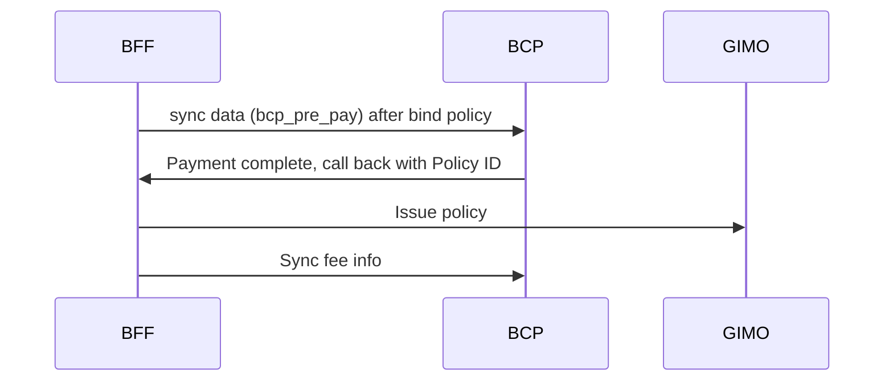
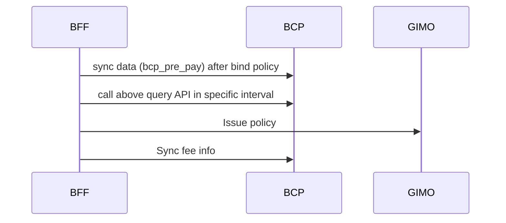

# NIC_BCP_integration

## Overview

### Project Background

The project is to integrate NIC easyPA and BCP system to support the business scenario of issuing policy after payment.

### Objectives

- To integrate NIC easyPA and BCP system to support the business scenario of issuing policy after payment.

- track integration process and ensure the integration is successful.

### Scope

Systems involved: BFF , GIMO , BCP

| System | Description                              |
|--------|------------------------------------------|
| BFF    | easyPA                                   |
| GIMO   | GI middle service                        |
| BCP    | BCP module in v3 core transaction system |

## Architecture

### Technology Stack

API Technologies: REST API, SOAP.

## Data Flow & Business Logic

### Solution A : Call back from BCP after payment complete



#### Business Logic Description

- BFF bound policy and sync data t pa bcp_pre_pay to BCP for first payment data

- BCP finish payment for per pay ,call back BFF with policy id or NO

- BFF call GIMO for issue policy and sync fee info to BCP

- track integration process and ensure the integration is successful.

### Solution B : BCP provide status API for Query



#### Business Logic Description for B

- BFF bound policy and sync data t pa bcp_pre_pay to BCP for first payment data

- BCP finish payment for pre-pay.

- BCP provide a query API to check pre-pay is paid or not.

- BFF call above query API in specific interval to check the pre-pay paid status. If paid, call GIMO for issue policy
  and sync fee info to BCP.

- track integration process and ensure the integration is successful.

## Interface Design

### BCP provide APIs:

- API One: to receive pre-pay data from pa and save into BCP. The payload mainly include:  fee type, fee amount, related
  business transaction info(policy info, agent info, policyholder/insured info, product info, payer info...)  .

- API Two: to receive the total fee info from pa and save into BCP. The payload is similar to API One.

- API Three:  to check paid status for pre-pay fee. The payload is trans type(NB, ENDO, Renew) and trans id(policy id,
  endo id, renew id). The response is paid status as Boolean value true or false.

### API Specifications

> The JSON format below is used to illustrate the payload structure, while the project implementation requires SOAP to
> adopt XML/WSDL representation.

#### API : receive pre pay data from pa

- Description: This API to receive pre-pay data from pa and save into BCP. The payload mainly include:  fee type, fee
  amount, related business transaction info(policy info, agent info, policyholder/insured info, product info, payer
  info...)  .

- Method: SOAP

- System : BCP

- URL: /bcp/prepay

- Request Payload:

```json
{
	"bizModule": "10",
	"bizSource": "1",
	"bizTransType": "NEWBIZ",
	"bizUniqueId": "10480820003,F1667CDCE5A70F96A903AB469718D075",
	"bookingCurrencyCode": "CNY",
	"branchCode": "10006",
	"channelCode": "PTY10000047304001",
	"claimNo": null,
	"currencyCode": "CNY",
	"directBookingEr": 1,
    "isPrepay": "N",
	"paymentMethod": "100",
	"paymentType": "1",
	"policyHolderName": "PolicyCollection",
	"policyHolderTypeCode": "",
	"policyHolderTypeName": "IndiCustomer",
	"policyNo": "POTBTI01238631",
	"productCode": "TBTI",
	"productLineCode": "Travel",
	"productName": "API TEST",
	"quotationNo": "",
	"refTransId": "10480820003,F1667CDCE5A70F96A903AB469718D075",
	"refTransNo": "POTBTI01238631",
	"totalPeriods": 1,
	"dynamicProperties": {},
	"feeList": [
		{
			"bcpFeeType": "100101",
			"amountSign": "+",
			"arapCate": "1",
			"arapStatus": "1",
			"bankName": null,
			"commissionStatus": "1",
			"creditCardHolderName": null,
			"creditCardNo": null,
			"orderStatus": "",
			"payerPayeeType": "IndiCustomer",
			"branchCode": "10006",
			"currencyCode": "CNY",
			"payerPayeeName": "PolicyCollection",
			"paymentMethod": "100",
			"totalPeriods": 1,
			"directEr": 1,
			"directBookingEr": 1,
			"amount": 1004.4,
			"balance": 1004.4,
			"feeId": 10480820015,
			"currentPeriod": 1,
			"dueDate": "2024-05-18",
			"glPostDueDate": "2024-05-18",
			"periodStartDate": "2024-05-18",
			"periodEndDate": "2024-05-18",
			"commission": 93,
			"tax": 74.4
		},
		{
			"bcpFeeType": "100400",
			"amount": 74.4,
			"amountSign": "+",
			"arapCate": "1",
			"arapStatus": "1",
			"commissionStatus": "1",
			"feeId": 10480820015,
			"branchCode": "10006",
			"dueDate": "2024-05-18",
			"glPostDueDate": "2024-05-18",
			"currencyCode": "CNY",
			"directEr": 1,
			"directBookingEr": 1,
			"currentPeriod": 1,
			"totalPeriods": 1,
			"periodStartDate": "2024-05-18",
			"periodEndDate": "2024-05-18",
			"payerPayeeName": "PolicyCollection",
			"payerPayeeType": "IndiCustomer",
			"paymentMethod": "100"
		},
		{
			"bcpFeeType": "100501",
			"amount": 930,
			"amountSign": "+",
			"arapCate": "1",
			"arapStatus": "1",
			"commissionStatus": "1",
			"feeId": 10480820015,
			"branchCode": "10006",
			"dueDate": "2024-05-18",
			"glPostDueDate": "2024-05-18",
			"currencyCode": "CNY",
			"directEr": 1,
			"directBookingEr": 1,
			"currentPeriod": 1,
			"totalPeriods": 1,
			"periodStartDate": "2024-05-18",
			"periodEndDate": "2024-05-18",
			"payerPayeeName": "PolicyCollection",
			"payerPayeeType": "IndiCustomer",
			"paymentMethod": "100"
		}
	]
}
```

- Response Payload:

```json
[
    {
        "@pk": 10473721498,
        "@type": "BcpArap-Arap",
        "Amount": 1004.4,
        "ArapCate": "1",
        "ArapId": "10473721498,F28FD2BF01580A36D0A2BF0349515204",
        "ArapNo": "DR20240500003747",
        "ArapStatus": "1",
        "ArapType": "-1001",
        "Balance": 1004.4,
        "BizTransId": "10473721494,21F48E90D78E99D2B12936D3317301E8",
        "BookingCurrencyCode": "CNY",
        "BusinessObjectId": 1100002651088,
        "Commission": 93,
        "CurrencyCode": "CNY",
        "CurrentPeriod": 1,
        "DirectBookingEr": 1,
        "DirectEr": 1,
        "DueDate": "2024-05-18",
        "GenerateDate": "2024-05-17T14:47:09.554",
        "HasMandate": "N",
        "HasNote": "N",
        "IsApproved": "N",
        "IsOffsetByCommission": "N",
        "LocalCurrencyCode": "INR",
        "NeedStatement": "N",
        "OffsetAmount": 0,
        "OffsetByCommissionAmount": 0,
        "OperateTime": "2024-05-17T14:47:09.554",
        "PayerPayeeName": "PolicyCollection",
        "PayerPayeeType": "IndiCustomer",
        "PaymentMethod": "100",
        "PeriodEndDate": "2024-05-18",
        "PeriodStartDate": "2024-05-18",
        "RefFeeId": 10473721495,
        "Tax": 74.4,
        "TotalPeriods": 1,
        "Transaction": {
            "@pk": 10473721494,
            "@type": "BcpBizTransaction-BizTransaction",
            "BizModule": "10",
            "BizSource": "1",
            "BizTransId": "10473721494,21F48E90D78E99D2B12936D3317301E8",
            "BizTransTime": "2024-05-17T14:47:06",
            "BizTransType": "NEWBIZ",
            "BizUniqueId": "10480820003,F1667CDCE5A70F96A903AB469718D075",
            "BookingCurrencyCode": "CNY",
            "BranchCode": "10006",
            "BranchName": "India Branch",
            "BusinessObjectId": 1100002651370,
            "ChannelCode": "PTY10000047304001",
            "ChannelName": "MANDYTEST0418 WU",
            "ChannelType": "13",
            "ChannelTypeName": "Individual Agent",
            "CurrencyCode": "CNY",
            "DirectBookingEr": 1,
            "DirectEr": 1,
            "HasMandate": "N",
            "LocalCurrencyCode": "INR",
            "PaymentMethod": "100",
            "PaymentType": "1",
            "PolicyHolderName": "PolicyCollection",
            "PolicyNo": "POTBTI01238631",
            "ProductCode": "TBTI",
            "ProductLineCode": "Travel",
            "ProductName": "API TEST",
            "RefTransId": "10480820003,F1667CDCE5A70F96A903AB469718D075",
            "RefTransNo": "POTBTI01238631",
            "TotalPeriods": 1
        },
        "VersionSeq": 1
    }
]
```

#### API : receive total fee data from pa

- Description: This API to receive the total fee info from pa and save into BCP. The payload is similar to API One.

- Method: SOAP

- System : BCP
- URL: /bcp/total/fee

- Request Payload:

```json

{
	"bizModule": "10",
	"bizSource": "1",
	"bizTransType": "NEWBIZ",
	"bizUniqueId": "10480820003,F1667CDCE5A70F96A903AB469718D075",
	"bookingCurrencyCode": "CNY",
	"branchCode": "10006",
	"channelCode": "PTY10000047304001",
	"claimNo": null,
	"currencyCode": "CNY",
	"directBookingEr": 1,
    "isPrepay": "N",
	"paymentMethod": "100",
	"paymentType": "1",
	"policyHolderName": "PolicyCollection",
	"policyHolderTypeCode": "",
	"policyHolderTypeName": "IndiCustomer",
	"policyNo": "POTBTI01238631",
	"productCode": "TBTI",
	"productLineCode": "Travel",
	"productName": "API TEST",
	"quotationNo": "",
	"refTransId": "10480820003,F1667CDCE5A70F96A903AB469718D075",
	"refTransNo": "POTBTI01238631",
	"totalPeriods": 1,
	"dynamicProperties": {},
	"feeList": [
		{
			"bcpFeeType": "100101",
			"amountSign": "+",
			"arapCate": "1",
			"arapStatus": "1",
			"bankName": null,
			"commissionStatus": "1",
			"creditCardHolderName": null,
			"creditCardNo": null,
			"orderStatus": "",
			"payerPayeeType": "IndiCustomer",
			"branchCode": "10006",
			"currencyCode": "CNY",
			"payerPayeeName": "PolicyCollection",
			"paymentMethod": "100",
			"totalPeriods": 1,
			"directEr": 1,
			"directBookingEr": 1,
			"amount": 1004.4,
			"balance": 1004.4,
			"feeId": 10480820015,
			"currentPeriod": 1,
			"dueDate": "2024-05-18",
			"glPostDueDate": "2024-05-18",
			"periodStartDate": "2024-05-18",
			"periodEndDate": "2024-05-18",
			"commission": 93,
			"tax": 74.4
		},
		{
			"bcpFeeType": "100400",
			"amount": 74.4,
			"amountSign": "+",
			"arapCate": "1",
			"arapStatus": "1",
			"commissionStatus": "1",
			"feeId": 10480820015,
			"branchCode": "10006",
			"dueDate": "2024-05-18",
			"glPostDueDate": "2024-05-18",
			"currencyCode": "CNY",
			"directEr": 1,
			"directBookingEr": 1,
			"currentPeriod": 1,
			"totalPeriods": 1,
			"periodStartDate": "2024-05-18",
			"periodEndDate": "2024-05-18",
			"payerPayeeName": "PolicyCollection",
			"payerPayeeType": "IndiCustomer",
			"paymentMethod": "100"
		},
		{
			"bcpFeeType": "100501",
			"amount": 930,
			"amountSign": "+",
			"arapCate": "1",
			"arapStatus": "1",
			"commissionStatus": "1",
			"feeId": 10480820015,
			"branchCode": "10006",
			"dueDate": "2024-05-18",
			"glPostDueDate": "2024-05-18",
			"currencyCode": "CNY",
			"directEr": 1,
			"directBookingEr": 1,
			"currentPeriod": 1,
			"totalPeriods": 1,
			"periodStartDate": "2024-05-18",
			"periodEndDate": "2024-05-18",
			"payerPayeeName": "PolicyCollection",
			"payerPayeeType": "IndiCustomer",
			"paymentMethod": "100"
		}
	]
}
```

- Response Payload:

```json

[
    {
        "@pk": 10473721498,
        "@type": "BcpArap-Arap",
        "Amount": 1004.4,
        "ArapCate": "1",
        "ArapId": "10473721498,F28FD2BF01580A36D0A2BF0349515204",
        "ArapNo": "DR20240500003747",
        "ArapStatus": "1",
        "ArapType": "-1001",
        "Balance": 1004.4,
        "BizTransId": "10473721494,21F48E90D78E99D2B12936D3317301E8",
        "BookingCurrencyCode": "CNY",
        "BusinessObjectId": 1100002651088,
        "Commission": 93,
        "CurrencyCode": "CNY",
        "CurrentPeriod": 1,
        "DirectBookingEr": 1,
        "DirectEr": 1,
        "DueDate": "2024-05-18",
        "GenerateDate": "2024-05-17T14:47:09.554",
        "HasMandate": "N",
        "HasNote": "N",
        "IsApproved": "N",
        "IsOffsetByCommission": "N",
        "LocalCurrencyCode": "INR",
        "NeedStatement": "N",
        "OffsetAmount": 0,
        "OffsetByCommissionAmount": 0,
        "OperateTime": "2024-05-17T14:47:09.554",
        "PayerPayeeName": "PolicyCollection",
        "PayerPayeeType": "IndiCustomer",
        "PaymentMethod": "100",
        "PeriodEndDate": "2024-05-18",
        "PeriodStartDate": "2024-05-18",
        "RefFeeId": 10473721495,
        "Tax": 74.4,
        "TotalPeriods": 1,
        "Transaction": {
            "@pk": 10473721494,
            "@type": "BcpBizTransaction-BizTransaction",
            "BizModule": "10",
            "BizSource": "1",
            "BizTransId": "10473721494,21F48E90D78E99D2B12936D3317301E8",
            "BizTransTime": "2024-05-17T14:47:06",
            "BizTransType": "NEWBIZ",
            "BizUniqueId": "10480820003,F1667CDCE5A70F96A903AB469718D075",
            "BookingCurrencyCode": "CNY",
            "BranchCode": "10006",
            "BranchName": "India Branch",
            "BusinessObjectId": 1100002651370,
            "ChannelCode": "PTY10000047304001",
            "ChannelName": "MANDYTEST0418 WU",
            "ChannelType": "13",
            "ChannelTypeName": "Individual Agent",
            "CurrencyCode": "CNY",
            "DirectBookingEr": 1,
            "DirectEr": 1,
            "HasMandate": "N",
            "LocalCurrencyCode": "INR",
            "PaymentMethod": "100",
            "PaymentType": "1",
            "PolicyHolderName": "PolicyCollection",
            "PolicyNo": "POTBTI01238631",
            "ProductCode": "TBTI",
            "ProductLineCode": "Travel",
            "ProductName": "API TEST",
            "RefTransId": "10480820003,F1667CDCE5A70F96A903AB469718D075",
            "RefTransNo": "POTBTI01238631",
            "TotalPeriods": 1
        },
        "VersionSeq": 1
    }
]

```

#### API : check paid status for pre-pay fee [use solution B]

- Description: to check paid status for pre-pay fee. The payload is biz trans type(NB, ENDO, Renew) and biz trans unique
  id . The response is paid status.

- Method: SOAP

- System : BCP

- URL: /bcp/prepay/status

- Request Payload :

```json
{
	"bizTransType": "NEWBIZ",
	"bizUniqueId": "10480820003,F1667CDCE5A70F96A903AB469718D075",
}

```

- Response Payload:

```json

{
    "paidStatus": "1",
    "paidMessage": "pre pay is paid"
}

```

### API : call back API after payment complete [use solution A]

- Description: call back API after payment complete. The payload is biz trans type(NB, ENDO, Renew) and biz trans unique
  id . The response is status

- Method: REST

- System : BFF

- URL: /bcp/callback

- Request Payload : TODO

```json
{
	"bizTransType": "NEWBIZ",
	"bizUniqueId": "10480820003,F1667CDCE5A70F96A903AB469718D075",
}
```

- Response Payload:

```json
{
   "status": "1",
   "message": "Success"
}

```

## Data Synchronization & Scheduling

### Scheduled Tasks

if solution B, BFF need to call BCP query API in specific interval to check the pre-pay paid status.

### Exception Handling

TODO How to handle exception in the integration process.

## Security & Access Control

TODO security and access control approach in network and API level.

### Data Encryption

### Audit Logs

## Appendix

### EasyPA Related Tables

| Table Name                 | Description                |
|----------------------------|----------------------------|
| t_pa_bcp_policy_fee        | Policy fee                 |
| t_pa_bcp_policy_fee_info   | Policy fee info            |
| t_pa bcp_policy_fee instal | Policy fee instalment info |
| t_pa_bcp_pre_pay           | Pre-pay info               |

🤖 AI-Powered Insights:

- Product A shows strong growth, contributing 43% of total sales.
- Bank channels outperform agent channels for Product B.
- Target marketing efforts for Product C in underperforming regions.


