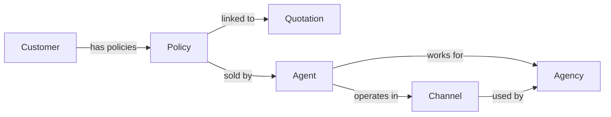

# Agency Data Mart

## Overview

Data mart for the insurance agency domain. The agency data mart provides insights into the sales performance of the
agency, agents, and products. It includes metrics such as gross premium, number of policies, and premium income for new
business. The data mart also includes dimensions such as product, agent, and customer to provide a comprehensive view of
the agency's sales performance.

## Data Mart Structure

| Metrics                             | Description                                                                                               |
|-------------------------------------|-----------------------------------------------------------------------------------------------------------|
| Gross Premium                       | Total premium income generated by each type of insurance product offered by the agency.                   |
| Premium Income for New Business     | Total premium income generated by new policies sold during a specific period.                             |
| Number of Policies for New Business | Total number of new policies sold during a specific period.                                               |
| Number of Policies                  | Total number of policies sold during a specific period.                                                   |
| Commission                          | The total amount paid out by the agency to insurance agents and brokers as commissions during the period. |
| Tax                                 | The total amount of tax paid by the agency during the period.                                             |
| Net Premium                         | The total premiums collected by the agency minus reinsurance premiums paid out during the period.         |
| Risk Premium                        | The total premiums collected by the agency minus the expected claims paid out during the period.          |

## Dimensions

| Dimension        | Description                                                                    |
|------------------|--------------------------------------------------------------------------------|
| Product          | The type of insurance product offered by the agency.                           |
| Agent            | The individual agent who sells insurance products on behalf of the agency.     |
| Agency           | The insurance agency that sells insurance products to customers.               |
| Customer         | The customer who purchases insurance products from the agency.                 |
| Channel          | The distribution channel through which insurance products are sold.            |
| Region           | The geographical region where the agency operates.                             |
| Policy Type      | The type of insurance policy sold by the agency.                               |
| Policy Status    | The status of the insurance policy (e.g., active, expired, canceled).          |
| Customer Segment | The segment of customers targeted by the agency (e.g., individual, corporate). |

## Domain List

| Domain       | Description                                                                           |
|--------------|---------------------------------------------------------------------------------------|
| Agent        | Represents the individual agent who sells insurance products on behalf of the agency. |
| Policy       | Represents the insurance policy sold to customers by the agent.                       |
| Product      | Represents the insurance product offered by the agency.                               |
| Customer     | Represents the customer who purchases insurance products from the agency.             |
| Channel      | Represents the distribution channel through which insurance products are sold.        |
| Quotation    | Represents the quotation provided to customers for insurance products.                |
| Agency       | Represents the insurance agency that sells insurance products to customers.           |
| Underwriting | Represents the process of evaluating and approving insurance policies.                |

## Domain Graph

