# Palantir Ontology Design for Life Insurance

## 1. Ontology Overview

This document defines the **Palantir Ontology** structure for a Life Insurance Company, derived from the `source_layer_documentation_en.md`. The Ontology transforms raw data tables into business-centric **Objects**, **Properties**, and **Links**, enabling operational decision-making and 360-degree views.

### 1.1 Conceptual Graph

```mermaid
graph TD
    Customer((Customer))
    Agent((Agent))
    Underwriter((Underwriter))
    ClaimsAdjuster((Claims Adjuster))
    ProductManager((Product Manager))

    Branch([Branch])
    OrgSales([Sales Organization])

    Policy[Policy]
    Proposal[Proposal]
    Claim[Claim]
    UWCase[Underwriting Case]
    Product[Insurance Product]
    InsLiab[Insurance Liability]
    RiskDomain[Risk Domain]
    Coverage[Policy Coverage]
    PolRole[Policy Role]
    PolAccount[Policy Account]
    Endorsement[Endorsement]
    Bonus[Bonus Allocation]
    ARAP[Accounts Receivable/Payable]
    BankAuth[Bank Account Authorization]
    Transaction[Financial Transaction]
    ClmCov[Claim Coverage]
    MedFee[Medical Fee]
    ClaimLiab[Claim Liability]

    Channel([Sales Channel])
    IndAgency[Individual Agency]
    Banc[Bancassurance]
    Online[Online]
    Telesales[Telesales]
    Intermediary[Professional Intermediary]

    Customer -- "Owns" --> Policy
    Customer -- "Submits" --> Proposal
    Customer -- "Files" --> Claim
    Proposal -- "Converts To" --> Policy
    Proposal -- "Triggers" --> UWCase

    Policy -- "Is Type Of" --> Product
    Product -- "Defines" --> InsLiab
    InsLiab -- "Categorized As" --> RiskDomain

    Proposal -- "Sourced From" --> Channel
    Policy -- "Sold Via" --> Channel
    Agent -- "Operates In" --> Channel
    Agent -- "Belongs To" --> Branch
    Branch -- "In" --> OrgSales

    Channel -- "Type" --> IndAgency
    Channel -- "Type" --> Banc
    Channel -- "Type" --> Online
    Channel -- "Type" --> Telesales
    Channel -- "Type" --> Intermediary

    Policy -- "Has" --> Coverage
    Policy -- "Has Role" --> PolRole
    PolRole -- "References" --> Customer
    Policy -- "Has" --> PolAccount
    Policy -- "Undergoes" --> Endorsement
    Policy -- "Receives" --> Bonus
    Policy -- "Has" --> ARAP
    Policy -- "Authorized By" --> BankAuth
    Policy -- "Generates" --> Transaction
    ARAP -- "Settled By" --> Transaction

    Claim -- "Linked To" --> Policy
    Claim -- "Has" --> ClmCov
    Claim -- "Has" --> MedFee
    Claim -- "Determines" --> ClaimLiab

    Policy -- "Underwent" --> UWCase
    Underwriter -- "Reviews" --> UWCase
    ClaimsAdjuster -- "Investigates" --> Claim
    ProductManager -- "Manages" --> Product

    classDef person fill:#E3F2FD,stroke:#1E88E5,stroke-width:1px,color:#0D47A1;
    classDef org fill:#E8F5E9,stroke:#43A047,stroke-width:1px,color:#1B5E20;
    classDef entity fill:#FFF3E0,stroke:#FB8C00,stroke-width:1px,color:#E65100;
    classDef taxonomy fill:#ECEFF1,stroke:#546E7A,stroke-width:1px,color:#263238;
    classDef finance fill:#F3E5F5,stroke:#8E24AA,stroke-width:1px,color:#4A148C;

    class Customer,Agent,Underwriter,ClaimsAdjuster,ProductManager person;
    class Branch,OrgSales org;
    class Policy,Proposal,Claim,UWCase,Product,InsLiab,Coverage,PolRole,PolAccount,Endorsement,Bonus,ClmCov,MedFee,ClaimLiab entity;
    class ARAP,BankAuth,Transaction finance;
    class Channel,RiskDomain,IndAgency,Banc,Online,Telesales,Intermediary taxonomy;
```

### 1.2 Color Legend

| Category | Fill | Stroke | Meaning |
| :--- | :--- | :--- | :--- |
| Person | Light Blue | Blue | Human roles and individuals (e.g., Customer, Agent). |
| Organization | Light Green | Green | Organizational units and structures (e.g., Branch, Sales Organization). |
| Business Entity | Light Orange | Orange | Core business objects/events (e.g., Policy, Claim, Proposal). |
| Finance | Light Purple | Purple | Settlement, billing, and payment artifacts (e.g., ARAP, Bank Auth, Financial Transaction). |
| Taxonomy | Light Gray | Slate Gray | Classification and code-list driven nodes (e.g., Sales Channel, Risk Domain). |

## 2. Object Type Definitions

### 2.1 Customer Domain (PTY)

**Object Type: `Customer`**
*   **Description**: Represents an individual or corporate entity holding a relationship with the insurer.
*   **Backing Dataset**: `src_pty_person_his` (Individuals), `src_pty_org_his` (Corporates)
*   **Primary Key**: `customer_id`
*   **Title Property**: `customer_name` / `org_name`
*   **Key Properties**:
    *   `id_card_no` (ID Number)
    *   `gender`
    *   `birth_date`
    *   `mobile_phone` (Mapped from `src_pty_contact_his`)
    *   `email` (Mapped from `src_pty_contact_his`)
    *   `address_full` (Mapped from `src_pty_address_his`)
    *   `customer_type` (Individual/Corporate)

### 2.2 Policy Domain (PA)

**Object Type: `Policy`**
*   **Description**: A contract of insurance between the insurer and the policyholder.
*   **Backing Dataset**: `src_pa_policy_his`
*   **Primary Key**: `policy_id`
*   **Title Property**: `policy_no`
*   **Key Properties**:
    *   `policy_status` (Active, Lapsed, Surrendered)
    *   `effective_date`
    *   `expiry_date`
    *   `premium_amount`
    *   `payment_mode` (Annual/Monthly)
    *   `sum_assured`

**Object Type: `Policy Role`**
*   **Description**: Represents the relationship between a policy and a customer (Policyholder, Insured, Beneficiary, etc.).
*   **Backing Dataset**: `src_pa_policy_role_his`
*   **Primary Key**: `policy_role_id`
*   **Title Property**: `role_type`
*   **Key Properties**:
    *   `role_type` (Policyholder, Insured, Beneficiary)
    *   `role_status`
    *   `role_start_date`
    *   `role_end_date`
    *   `customer_id`

**Object Type: `Policy Coverage`**
*   **Description**: Specific coverage details within a policy (e.g., Death Benefit, Critical Illness Rider).
*   **Backing Dataset**: `src_pa_policy_coverage_his`
*   **Primary Key**: `coverage_id` (Derived)
*   **Title Property**: `coverage_name`
*   **Key Properties**:
    *   `coverage_code`
    *   `benefit_amount`
    *   `premium_portion`

**Object Type: `Endorsement`**
*   **Description**: Records of post-issue changes to the policy (e.g., Change of Beneficiary, Address Change, Sum Assured Adjustment).
*   **Backing Dataset**: `src_pa_policy_change_his`
*   **Primary Key**: `chg_id`
*   **Title Property**: `change_type`
*   **Key Properties**:
    *   `change_type` (e.g., Address Change, Beneficiary Change, Reinstatement)
    *   `change_status` (Pending, Approved, Rejected)
    *   `apply_date`
    *   `effective_date`
    *   `change_reason`
    *   `applicant_id`

### 2.3 Claims Domain (CLM)

**Object Type: `Claim`**
*   **Description**: A formal request by a policyholder for coverage or compensation for a covered loss.
*   **Backing Dataset**: `src_clm_claim_case_his`
*   **Primary Key**: `case_id`
*   **Title Property**: `case_no`
*   **Key Properties**:
    *   `incident_date`
    *   `report_date`
    *   `claim_status` (Reported, Investigating, Paid, Closed)
    *   `claim_cause`
    *   `total_claimed_amount`
    *   `total_paid_amount`

**Object Type: `Claim Coverage`**
*   **Description**: Coverage-level details of a claim, including amounts by coverage/rider.
*   **Backing Dataset**: `src_clm_claim_coverage_his`
*   **Primary Key**: `claim_coverage_id`
*   **Title Property**: `coverage_name`
*   **Key Properties**:
    *   `coverage_code`
    *   `claimed_amount`
    *   `approved_amount`
    *   `paid_amount`

**Object Type: `Medical Fee`**
*   **Description**: Medical expense line items associated with a claim case.
*   **Backing Dataset**: `src_clm_medical_fee_his`
*   **Primary Key**: `medical_fee_id`
*   **Title Property**: `invoice_no`
*   **Key Properties**:
    *   `exam_date`
    *   `exam_type`
    *   `exam_fee`
    *   `gst_amount`
    *   `clinic_code`

**Object Type: `Claim Liability`**
*   **Description**: Liability assessment records for a claim, including liability amount and ratio.
*   **Backing Dataset**: `src_clm_claim_liab_his`
*   **Primary Key**: `claim_liab_id`
*   **Title Property**: `liability_type`
*   **Key Properties**:
    *   `liability_type`
    *   `liability_date`
    *   `liability_ratio`
    *   `liability_amount`
    *   `liability_reason`

### 2.4 Sales & Distribution (SC)

**Object Type: `Sales Channel`**
*   **Description**: High-level sales channel classification used for distribution reporting, governance, and channel strategy (e.g., Individual Agency, Bancassurance, Online, Telesales, Professional Intermediary).
*   **Backing Dataset**: `src_cd_code_record_his` (Filtered by `code_type`='sales_channel')
*   **Primary Key**: `code_value`
*   **Title Property**: `code_desc`
*   **Key Properties**:
    *   `code_type`
    *   `effective_date`
    *   `expiry_date`
*   **Recommended Channel Types**:
    *   **Individual Agency**:
        *   **Characteristics**: The largest headcount channel (800M+ agents), broad geographic coverage, many outlets, face-to-face customer engagement, strong ability to understand personalized needs.
        *   **Model**: Agency system where the insurer bears responsibility for agent conduct; requires strong governance to prevent mis-selling.
    *   **Bancassurance**:
        *   **Characteristics**: Uses banks’ extensive branch network and customer base to sell life insurance products.
        *   **Model**: Banks act as agents distributing insurance products; bank staff sell after training.
    *   **Online**:
        *   **Characteristics**: Online purchase via official website, mobile app, or third-party platforms; convenient and fast; typically standardized products.
    *   **Telesales**:
        *   **Characteristics**: Phone-based sales; suitable for standardized products; relatively lower cost.
    *   **Professional Intermediary**:
        *   **Characteristics**: Distributes products from multiple insurers and provides comprehensive solutions; typically subject to regulatory constraints (e.g., individual agents cannot represent multiple life insurers).

**Object Type: `Agent`**
*   **Description**: A licensed professional authorized to sell insurance products.
*   **Backing Dataset**: `src_sc_agent_his`
*   **Primary Key**: `agent_id`
*   **Title Property**: `agent_name`
*   **Key Properties**:
    *   `agent_code`
    *   `agent_level`
    *   `agent_type`
    *   `license_no`
    *   `join_date`
    *   `status` (Active/Terminated)

**Object Type: `Branch`**
*   **Description**: An organizational unit managing a group of agents.
*   **Backing Dataset**: `src_sc_branch_his`
*   **Primary Key**: `branch_code`
*   **Title Property**: `branch_name`
*   **Key Properties**:
    *   `branch_type`

### 2.5 Product Domain (PRD)

**Object Type: `Insurance Product`**
*   **Description**: The definition of an insurance product sold by the company.
*   **Backing Dataset**: `src_prd_product_his`
*   **Primary Key**: `product_id`
*   **Title Property**: `product_name`
*   **Key Properties**:
    *   `product_code`
    *   `product_type` (Life, Health, Annuity)
    *   `launch_date`
    *   `withdrawal_date`

**Object Type: `Insurance Liability`**
*   **Description**: The benefit/coverage definition that a product provides (e.g., Death, CI, Medical, Disability, Annuity payout).
*   **Backing Dataset**: `src_prd_liability_his`
*   **Primary Key**: `liab_id`
*   **Title Property**: `liab_name`
*   **Key Properties**:
    *   `liab_code`
    *   `liab_type`
    *   `liab_status`
    *   `effective_date`
    *   `liab_desc`

**Object Type: `Risk Domain`**
*   **Description**: Risk domain taxonomy used to classify product liabilities (e.g., Mortality, Morbidity, Longevity, Investment, Lapse).
*   **Backing Dataset**: `src_cd_code_record_his` (Filtered by `code_type`='risk_domain')
*   **Primary Key**: `code_value`
*   **Title Property**: `code_desc`
*   **Key Properties**:
    *   `code_type`
    *   `effective_date`
    *   `expiry_date`

### 2.6 Finance & Billing (BCP/PAC)

**Object Type: `Bonus Allocation`**
*   **Description**: Records of dividends or bonuses allocated to participating policies (e.g., Reversionary Bonus, Terminal Bonus).
*   **Backing Dataset**: `src_pac_bonus_allocate`
*   **Primary Key**: `allocation_id`
*   **Title Property**: `bonus_type`
*   **Key Properties**:
    *   `allocation_date`
    *   `bonus_type` (Reversionary, Terminal, Special)
    *   `allocated_amount`
    *   `dividend_option` (Cash, Accumulate, PUA)
    *   `fiscal_year`

**Object Type: `Accounts Receivable/Payable`**
*   **Description**: Billing and settlement items linked to a policy (premium due, refunds, offsets, etc.).
*   **Backing Dataset**: `src_bcp_arap_his`
*   **Primary Key**: `arap_id`
*   **Title Property**: `arap_type`
*   **Key Properties**:
    *   `arap_type`
    *   `amount`
    *   `balance`
    *   `premium`
    *   `tax`
    *   `due_date`
    *   `status`

**Object Type: `Bank Account Authorization`**
*   **Description**: Bank account authorization records for premium collection and other debits.
*   **Backing Dataset**: `src_bcp_account_auth_his`
*   **Primary Key**: `detail_id`
*   **Title Property**: `account_no`
*   **Key Properties**:
    *   `account_no`
    *   `bank_code`
    *   `account_holder_name`
    *   `account_status`
    *   `account_effective_date`

**Object Type: `Financial Transaction`**
*   **Description**: An individual movement of money (Premium collection, Claim payment).
*   **Backing Dataset**: `src_bcp_biz_trans_his`
*   **Primary Key**: `biz_trans_id`
*   **Title Property**: `trans_desc`
*   **Key Properties**:
    *   `trans_amount`
    *   `trans_date`
    *   `trans_type` (Collection/Payment)
    *   `currency`

**Object Type: `Policy Account`**
*   **Description**: The cash value or investment account associated with a policy.
*   **Backing Dataset**: `src_pac_pol_acc_trans` (Aggregated) or similar summary view
*   **Primary Key**: `policy_id` (One-to-One with Policy usually, or specific Account ID)
*   **Title Property**: `account_type`
*   **Key Properties**:
    *   `account_balance`
    *   `accumulated_dividend`
    *   `cash_value`

### 2.7 Underwriting (UW)

**Object Type: `Underwriting Case`**
*   **Description**: The risk assessment record for a policy application.
*   **Backing Dataset**: `src_uw_policy`
*   **Primary Key**: `uw_case_id`
*   **Title Property**: `application_no`
*   **Key Properties**:
    *   `uw_decision` (Standard, Rated, Declined)
    *   `risk_score`
    *   `medical_flag` (Yes/No)
    *   `decision_date`

### 2.8 Proposal Management (PROP)

**Object Type: `Proposal`**
*   **Description**: An application for insurance submitted by a potential policyholder, pending underwriting decision. Represents the pre-contractual phase.
*   **Backing Dataset**: `src_prop_proposal_his`
*   **Primary Key**: `proposal_id`
*   **Title Property**: `proposal_no`
*   **Key Properties**:
    *   `submission_date`
    *   `proposal_status` (Draft, Submitted, Underwriting, Approved, Rejected, Withdrawn)
    *   `proposed_sum_assured`
    *   `proposed_premium`
    *   `quotation_ref` (Reference to initial quote)
    *   `channel_source` (Agent/Online/Bank)

**Object Type: `Proposal Coverage`**
*   **Description**: The specific insurance coverages and riders requested in the proposal.
*   **Backing Dataset**: `src_prop_coverage_his`
*   **Primary Key**: `prop_coverage_id` (Derived)
*   **Title Property**: `coverage_name`
*   **Key Properties**:
    *   `coverage_code`
    *   `requested_sum_assured`
    *   `requested_premium`

### 2.9 Internal Organization Roles

**Object Type: `Underwriter`**
*   **Description**: Specialized staff responsible for risk assessment and policy approval.
*   **Backing Dataset**: `src_hr_employee_his` (Filtered by Role='Underwriter')
*   **Primary Key**: `employee_id`
*   **Title Property**: `employee_name`
*   **Key Properties**:
    *   `authority_limit` (Max Sum Assured)
    *   `specialization` (Medical, Financial, Jumbo)
    *   `email`

**Object Type: `Claims Adjuster`**
*   **Description**: Specialized staff responsible for investigating and settling claims.
*   **Backing Dataset**: `src_hr_employee_his` (Filtered by Role='Claims Adjuster')
*   **Primary Key**: `employee_id`
*   **Title Property**: `employee_name`
*   **Key Properties**:
    *   `approval_limit` (Max Claim Amount)
    *   `region`
    *   `email`

**Object Type: `Product Manager`**
*   **Description**: Staff responsible for designing and managing insurance products.
*   **Backing Dataset**: `src_hr_employee_his` (Filtered by Role='Product Manager')
*   **Primary Key**: `employee_id`
*   **Title Property**: `employee_name`
*   **Key Properties**:
    *   `product_line` (Life, Health, Annuity)
    *   `email`

## 3. Link Type Definitions (Relationships)

| Link Name | Source Object | Target Object | Cardinality | Description |
| :--- | :--- | :--- | :--- | :--- |
| **Customer_Holds_Policy** | `Customer` | `Policy` | 1 : Many | A customer can hold multiple policies. |
| **Policy_Insures_Customer** | `Policy` | `Customer` | Many : Many | A policy can insure multiple people (Main + Dependents). |
| **Policy_Has_Role** | `Policy` | `Policy Role` | 1 : Many | A policy contains multiple roles (PH, LA, Beneficiary). |
| **Role_Is_Customer** | `Policy Role` | `Customer` | Many : 1 | Each policy role references a customer. |
| **Policy_Has_Claim** | `Policy` | `Claim` | 1 : Many | A policy can have multiple claims over time. |
| **Claim_Has_Coverage** | `Claim` | `Claim Coverage` | 1 : Many | A claim includes one or more coverages/riders. |
| **Claim_Has_MedicalFee** | `Claim` | `Medical Fee` | 1 : Many | A claim includes medical fee line items. |
| **Claim_Has_Liability** | `Claim` | `Claim Liability` | 1 : Many | A claim has one or more liability assessment records. |
| **Agent_Sells_Policy** | `Agent` | `Policy` | 1 : Many | An agent sells and services many policies. |
| **Agent_BelongsTo_Branch** | `Agent` | `Branch` | Many : 1 | Agents are grouped into branches. |
| **Policy_IsType_Product** | `Policy` | `Insurance Product` | Many : 1 | Many policies share the same product definition. |
| **Product_Has_Liability** | `Insurance Product` | `Insurance Liability` | Many : Many | Product liabilities defined via association table. |
| **Liability_In_RiskDomain** | `Insurance Liability` | `Risk Domain` | Many : 1 | Each liability is categorized into a risk domain. |
| **Policy_Has_Coverage** | `Policy` | `Policy Coverage` | 1 : Many | A policy consists of one or more coverages. |
| **Policy_Has_Endorsement** | `Policy` | `Endorsement` | 1 : Many | A policy can have multiple endorsements (changes) over its lifecycle. |
| **Policy_Has_Bonus** | `Policy` | `Bonus Allocation` | 1 : Many | A policy receives multiple bonus allocations over time. |
| **Policy_Has_ARAP** | `Policy` | `Accounts Receivable/Payable` | 1 : Many | Billing items and balances linked to the policy. |
| **Policy_Has_BankAuth** | `Policy` | `Bank Account Authorization` | 1 : Many | Auto-debit authorizations linked to the policy. |
| **ARAP_SettledBy_Transaction** | `Accounts Receivable/Payable` | `Financial Transaction` | Many : Many | Financial transactions settle receivable/payable items. |
| **Policy_Has_Transaction** | `Policy` | `Financial Transaction` | 1 : Many | All billing events linked to the policy. |
| **Policy_SoldVia_Channel** | `Policy` | `Sales Channel` | Many : 1 | A policy is sold via a primary sales channel. |
| **Proposal_SourcedFrom_Channel** | `Proposal` | `Sales Channel` | Many : 1 | A proposal is sourced from a sales channel. |
| **Agent_OperatesIn_Channel** | `Agent` | `Sales Channel` | Many : 1 | An agent is associated with a sales channel. |
| **Policy_Has_UWCase** | `Policy` | `Underwriting Case` | 1 : 1 | The initial underwriting record for the policy. |
| **Customer_Submits_Proposal** | `Customer` | `Proposal` | 1 : Many | A customer submits one or more proposals. |
| **Proposal_ConvertsTo_Policy** | `Proposal` | `Policy` | 1 : 1 | A successful proposal becomes a policy. |
| **Proposal_Triggers_UW** | `Proposal` | `Underwriting Case` | 1 : 1 | A proposal initiates an underwriting case. |
| **UWCase_AssignedTo_Underwriter** | `Underwriting Case` | `Underwriter` | Many : 1 | An underwriting case is reviewed by a specific underwriter. |
| **Claim_AssignedTo_Adjuster** | `Claim` | `Claims Adjuster` | Many : 1 | A claim is processed by a claims adjuster. |
| **Product_ManagedBy_PM** | `Insurance Product` | `Product Manager` | Many : 1 | A product is managed by a product manager. |

## 4. Operational Action Types (Write-Back)

Ontology Actions allow users to modify data or trigger workflows directly from the object view.

*   **Update Customer Contact Info**:
    *   *Target*: `Customer`
    *   *Effect*: Updates `mobile_phone`, `email`, `address` in `src_pty_contact_his`.
    *   *Validation*: Phone number format check.

*   **Log New Claim (FNOL)**:
    *   *Target*: `Policy`
    *   *Effect*: Creates a new `Claim` object linked to this Policy.
    *   *Inputs*: Incident Date, Cause, Estimated Amount.

*   **Reassign Agent**:
    *   *Target*: `Policy`
    *   *Effect*: Changes the link `Agent_Sells_Policy` to a new `Agent`.
    *   *Trigger*: Sends notification to the new agent.

*   **Flag for Fraud Review**:
    *   *Target*: `Claim`
    *   *Effect*: Updates `claim_status` to "Under Investigation" and creates a task for the SIU.
    *   *Assignee*: Automatically assigns to a specialized SIU Investigator (Role-based assignment).

*   **Assign Claim**:
    *   *Target*: `Claim`
    *   *Effect*: Links the claim to a specific `Claims Adjuster`.
    *   *Inputs*: Select Adjuster (Select from `Claims Adjuster` objects).

*   **Request Endorsement**:
    *   *Target*: `Policy`
    *   *Effect*: Creates a new `Endorsement` object linked to this Policy.
    *   *Inputs*: Change Type (e.g., Change Beneficiary), Reason, Effective Date.

*   **Set Up Auto Debit**:
    *   *Target*: `Policy`
    *   *Effect*: Creates a new `Bank Account Authorization` object linked to this Policy.
    *   *Inputs*: Bank Code, Account No, Account Holder Name, Effective Date.

*   **Submit New Proposal**:
    *   *Target*: `Customer`
    *   *Effect*: Creates a new `Proposal` object linked to the Customer.
    *   *Inputs*: Product selection, Sum Assured, Premium.

*   **Issue Policy (Convert Proposal)**:
    *   *Target*: `Proposal`
    *   *Effect*: Updates `proposal_status` to "Issued" and creates a new `Policy` object.
