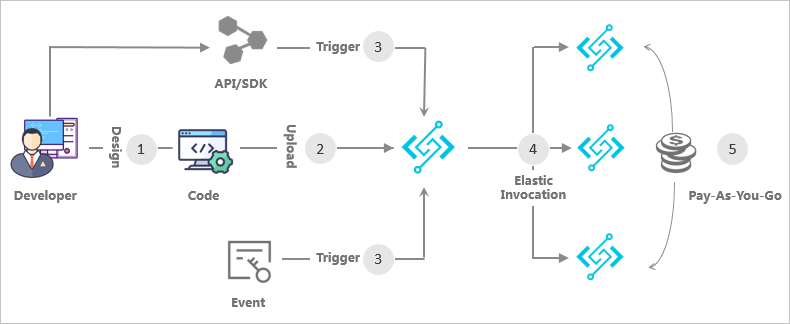

# Watchmen Serverless
Watchmen support executing pipelines in serverless mode on the public cloud. 
Serverless technologies feature automatic scaling, built-in high availability, and a pay-for-use billing model to increase agility and optimize costs.

# Workflow
Cloud providers have their own Function Compute Service of the Serverless architecture. The implementations are different, but the logic of workflow is almost the same. 
The following figure shows the workflow of Function Compute.

  
The corresponding steps are described as follows: 
1. The developer writes code to create an application and a service by using a programming language.
2. The developer uploads the application to Function Compute. The application can be uploaded in the following ways:
    * The Function Compute Console.
    * The command-line tool.
    * Function Compute API or SDKs.
3. The developer or an event triggers function execution. Functions can be triggered by Object Storage, API Gateway, Log Service and Function Compute API and SDKs.
4. Function Compute dynamically scales out to respond to the request. Function Compute can automatically scale out based on the number of user requests. This process is transparent to you and your customers.
5. Cloud providers bills Function Compute based on the actual execution duration. After the function is executed, you can view the execution fees on the bill. 

# Function Compute In Different Public Cloud
1. AWS Lambda
2. Azure Functions
3. Alibaba Cloud Function Compute

The sample code for different cloud providers has been listed in the project. 
This code shows the scenario that the object storage trigger event to starts a function when a new object is detected.
please refer to the sample for the detail information. 


# Pipelines Execution with serverless
Depend on the sdk which watchmen provided, you can build your own pipeline execution function.

## dependence
watchmen-pipeline-surface

watchmen-storage-mysql(mssql, oracle, postgresql)


## develop function

The core method is try_to_invoke_pipelines, there are three input parameters.

Here's the Python code:
```pathon
asyncio.run(try_to_invoke_pipelines(trigger_data, trace_id, principal_service))
```
### Input parameters

|  Parameter   | Type | Description |
|  ----  | ----  | ----|
| trigger_data | PipelineTriggerDataWithPAT | The trigger data of raw topic with pat  |
| trace_id  | PipelineTriggerTraceId | The unique id to tracing monitor |
| principal_service| PrincipalService | The information of authentication

#### 1. trigger_data
Here's the Python code:
```pathon
trigger_data = PipelineTriggerDataWithPAT(pat=event.get('pat'), code=event.get('code'), data=event.get('data'))
```
You can get pat, code , data from the storage contents. construct the trigger data.

#### 2. trace_id
Here's the Python code:
```pathon
trace_id: PipelineTriggerTraceId = str(ask_snowflake_generator().next_id())
```
Generate the snowflake id as trace id. 

#### 3. principal_service
Here's the Python code:
```pathon
principal_service = get_principal_by_pat(retrieve_authentication_manager(), pat, [UserRole.ADMIN, UserRole.SUPER_ADMIN])
```

Because the principal_service need the authentication_manger, so need initial and register authentication manager first

Here's the Python code:
```pathon
settings = RestSettings()
register_authentication_manager(build_authentication_manager(settings, build_find_user_by_name(), build_find_user_by_pat(), []))
```

# Storage Content
In the sample, the structure of storage content should be like following:
```json
{
   "code": "sample_raw_topic",
   "data": {"propa": "value1", "propb": "value2", "propc": "value3"},
   "pat": "8KJy******Z2o2u9jnPmuA"
}
```

